# 利率
## Rate
### spot rate
1. 定义：
2. 如何获得：零息国债价格倒算，如果没有特定期限的零息债券，可以使用剥息法或线性插值法。
3. 无套利理论
4. 折现因子
### forward rate
1. 定义：
2. 计算：

$$
(1 + Z_B)^B = (1 + Z_A)^A (1 + f_{A,B-A})^{B-A}
$$

- **定义**：用于计算在时间 A 交割 T 年期债券的远期合约价格（计算用的都是折现因子）

$$
\text{DF}_B = \text{DF}_A \times F_{A,B-A}
$$

$$
F_{A,B-A} = \frac{\text{DF}_B}{\text{DF}_A}
$$

即期利率曲线和远期利率曲线的位置关系是：如果向上倾斜，远期在上面；如果向下倾斜，远期在下。par（YTM）永远在中间。
### par rate
1. 本质：使得债券价格正好等于面值的票息率
2. 应用：前向计算spot rate
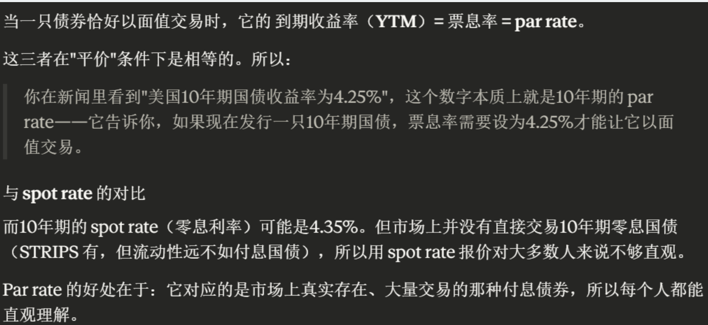
### YTM
1. 本质：即期利率的加权平均
2. 保证YTM是理论上回报率的假设（本质上是为了保证所有现金流是确定的）
- 持有至到期：债券被持有至到期日，不中途出售。
- 无违约：所有票息与本金均按时足额支付。
- 票息再投资：所有票息收入都能以YTM 利率再投资。

## Spread
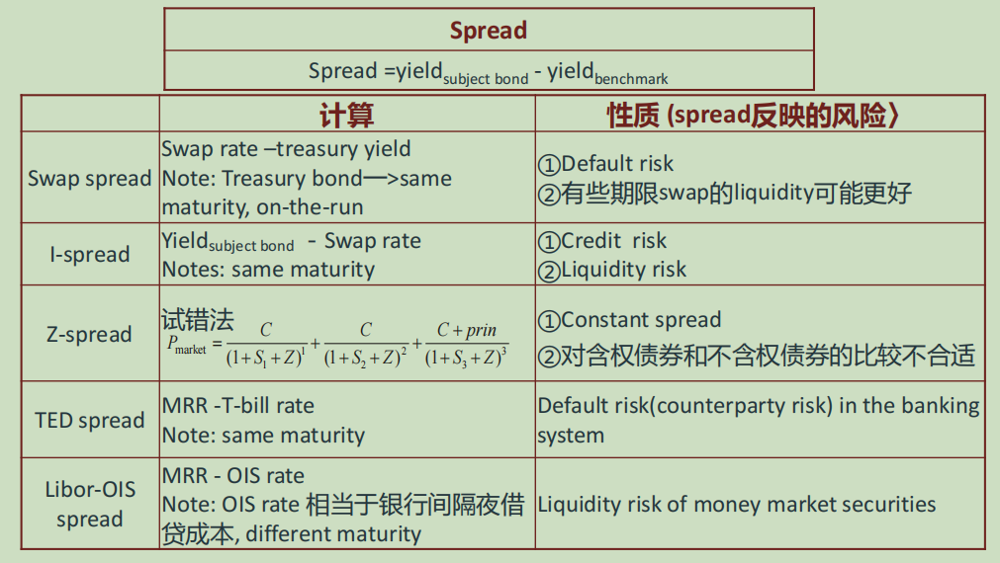
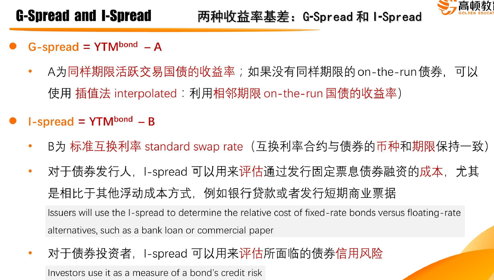
G-spread=swap spread+I-spread
### swap spread

### I-spread

### TED spread
银行间信用风险

### Z-spread
分母利率的调整项
### Libor-OIS Spread
银行间流动性风险
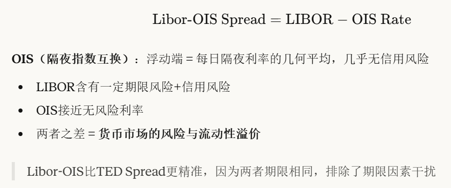

## curve
### 理论
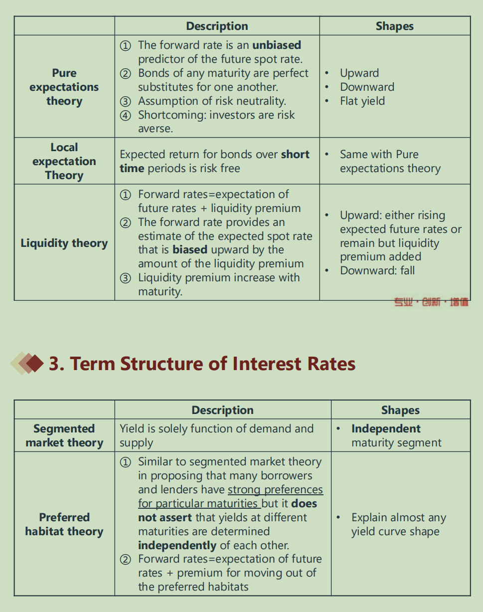
#### 纯预期理论-pure expectations theory
认为远期利率是未来即期利率的无偏估计
假设市场中性，但是实际上是风险厌恶的
#### local exceptiom theory
仅假设短期内是市场中性的
#### 流动性偏好理论
远期利率是未来即期利率的估计在加上流动性补偿
#### segmented market theory
不同期限的市场是分隔开的。
投资者和借款人基于自身偏好（如银行偏好短期资产、养老金偏好长期负债匹配）集中在特定期限市场中，导致各期限的利率由该期限市场的供需独立决定，而非由预期或流动性溢价驱动。
#### preferred habitat theory
投资者有期限偏好，但如果补偿足够大，愿意离开舒适区。

#### Flight to quality（bullish flattening）
定义：Flight to quality 指市场风险偏好骤降时，投资者抛售信用风险资产（如Corp Bond、EM Debt），集中买入无违约风险的US Treasury。
驱动机制：长端国债需求激增 → 价格↑ → yield↓；短端受OIS/FFR锚定，调整滞后且幅度小。
典型表现：长端yield降幅 > 短端 → curve flattens + bullish（因price↑）

### 曲线形态
1. 水平变动（Level movement）
2. 陡峭度变动（Steepness movement）——短期利率与长期利率变动幅度不一致
3. 曲度变动（Curvature movement）——短端和长端利率同向变动，而中端利率反向变动
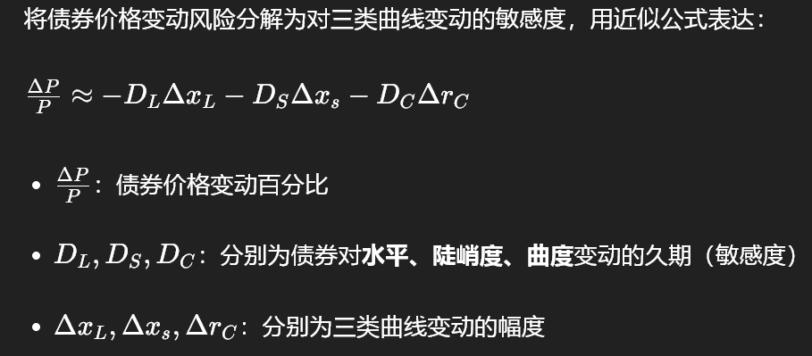

### 管理曲线风险
1. 有效久期（Effective Duration, ED）：专门应对收益率曲线平行移动带来的风险（即水平风险），无法捕捉收益率曲线形状变化（陡峭化、弯曲化等 “塑形风险”）
2. 关键利率久期（Key Rate Duration, KRD）：衡量债券价格对基准收益率曲线某一特定期限段的小幅变动的敏感度。

### 宏观经济对曲线的影响
通胀主要影响长短利率，货币政策主要影响短端利率。
#### 货币政策
经济扩张期：央行加息 → 短期收益率上行 > 长期 → 看空扁平化（bearish flattening）
经济衰退 / 预期衰退期：央行降息 → 短期收益率下行 > 长期 → 看多陡峭化（bullish steepening）
#### 财政政策
财政赤字扩大——债券供给增加，收益率上升
财政赤字缩小——债券供给减少，收益率下降
#### flight to quality
避险情绪（flight to quality） → 资金涌入国债，长期收益率下行 > 短期 → 看多扁平化（bullish flattening）
转向Barbell的逻辑：牛平时长端下降最多，长债价格涨幅最大，Barbell中长端头寸受益最多。
### 骑乘策略

# 不含权债券定价
## 无风险套利
### 套利机会
1. 价值可加性（Value additivity）
整体的价值必须等于其各组成部分价值之和。
若 “整体价格 ≠ 各部分价格之和”，就存在套利空间（如拆分 / 重组套利）。
2. 支配性（Dominance）
未来能产生无风险回报的金融资产，当前价格必须为正。
若存在 “未来正现金流、当前价格≤0” 的资产，就存在套利机会。
### 固定收益证券的无套利视角
任何固定收益证券都可被视为零息债券的组合 / 资产包，这是无套利定价的核心思路：
剥离（Stripping）：将附息债券拆分为多个零息债券（本息分离）。
重组（Reconstitution）：将多个零息债券重新组合成附息债券。

## 二叉树模型
### 假设
利率服从对数正态分布
上下概率都是50%
用 spot 作为 benchmark
假设波动性是常数
### 节点数据的生成
#### 均值回归模型-均衡模型（equilibrium models）
基于经济假设推导出长期均衡利率行为
1. CIR模型
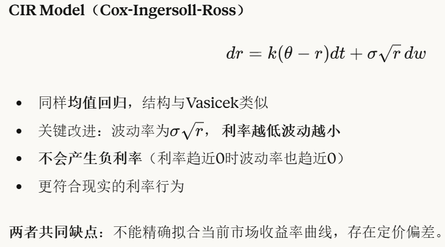
2. Vasicek 模型
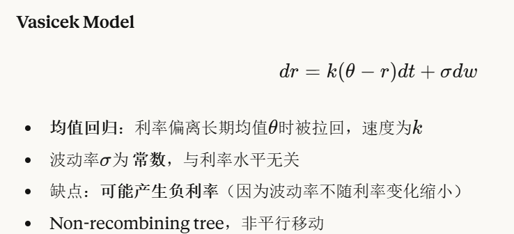
#### 无套利模型
1. Ho-Lee模型
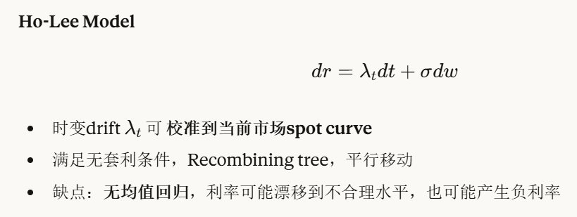
2. KWF模型-不会产生负利率
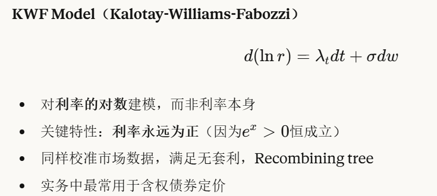
### 计算
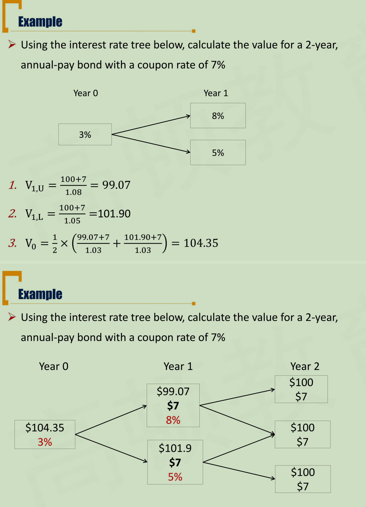

## 蒙特卡洛模拟
1. 本质：二叉树假设不存在路径依赖，蒙特卡洛模拟解决的是存在路径依赖时的问题
2. 特点：Monte Carlo通过模拟大量利率路径来定价，需要drift adjustment校准至无套利，通过增加路径数量提高精度，通过设置上下界实现均值回归——本质上是二叉树在路径依赖型产品（如MBS）上的扩展替代方案。

# 含权债券定价
## callable bond
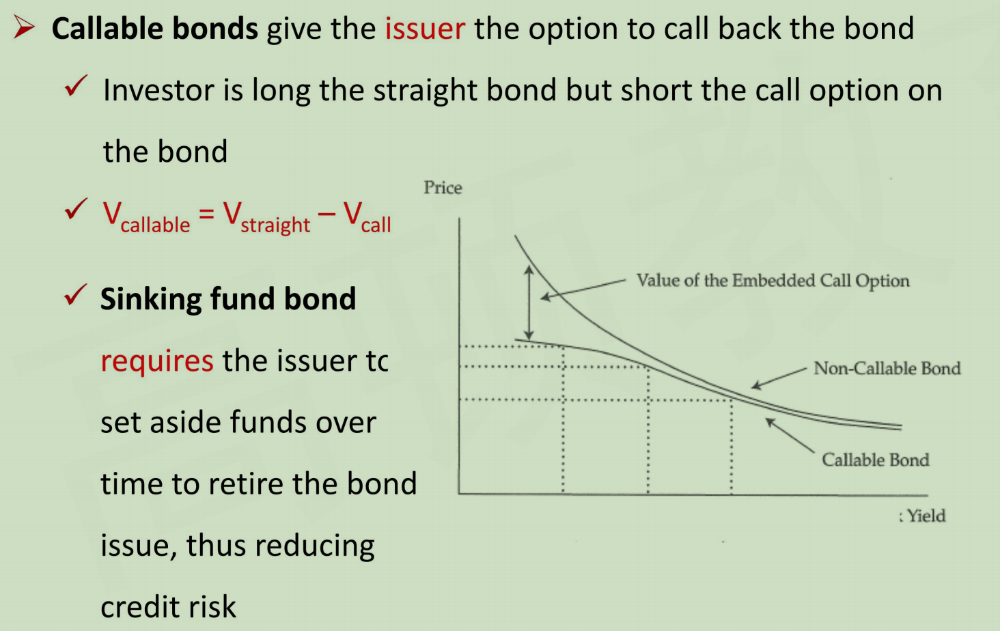

$$
V_{\text{call}} = V_{\text{noncallable}} - V_{\text{callable}}
\quad \Leftrightarrow \quad
V_{\text{callable}} = V_{\text{noncallable}} - V_{\text{call}}
$$

## putable bond
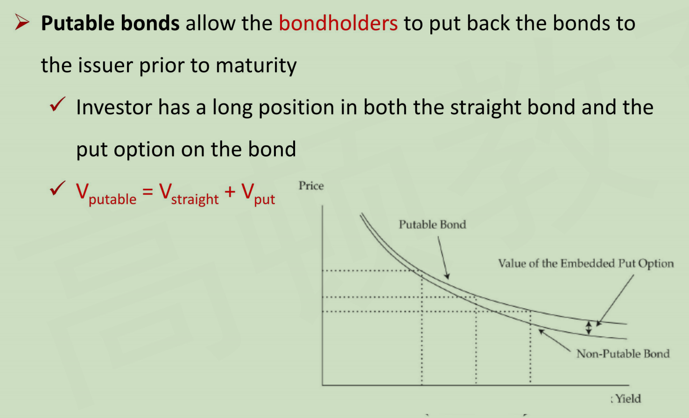

$$
V_{\text{put}} = V_{\text{putable}} - V_{\text{nonputable}}
\quad \Leftrightarrow \quad
V_{\text{putable}} = V_{\text{nonputable}} + V_{\text{put}}
$$

## convertible bond
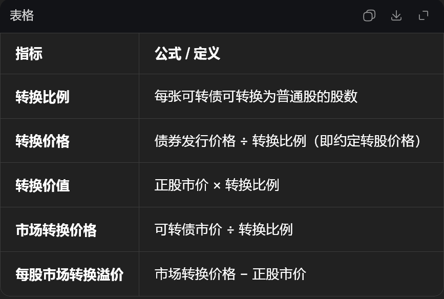
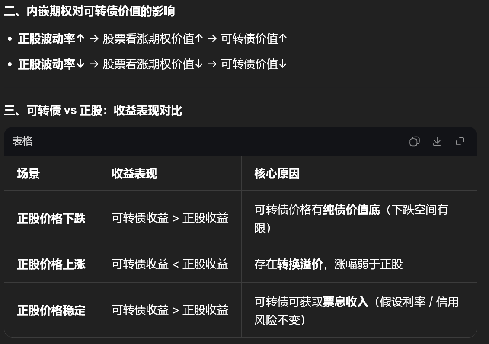
## OAS
结论:call反向，put同向
波动率上升，callable价值下降，callable的OAS下降
波动率上升，putable价值上升，callable的OAS上升
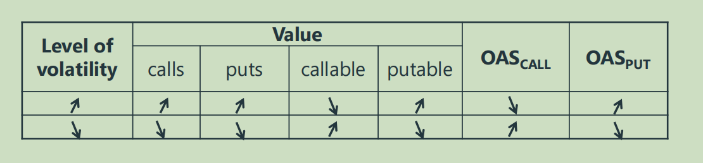
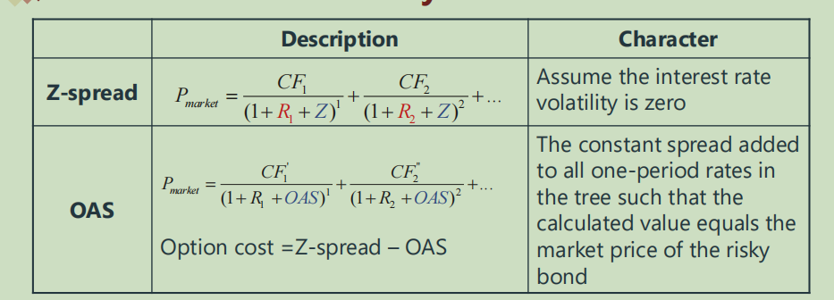
### 估值应用
OAS < 同类可比债：债券 likely 高估（rich），应避免
OAS > 同类可比债：债券 likely 低估（cheap），更具吸引力
OAS ≈ 同类可比债：债券定价公允
# 利率风险
本质：含权债券需要使用有效久期，单边久期和key rate久期来进行计算
久期：
- Yield Duration——只适用于无含权债券
- Curve Duration——适用于所有债券，包括含权债券
## 有效久期
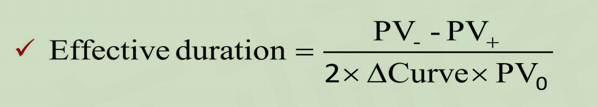
## 有效凸度
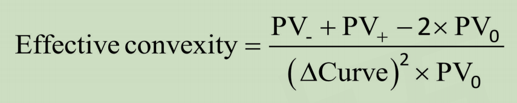
## one-side durations
## key rate duration
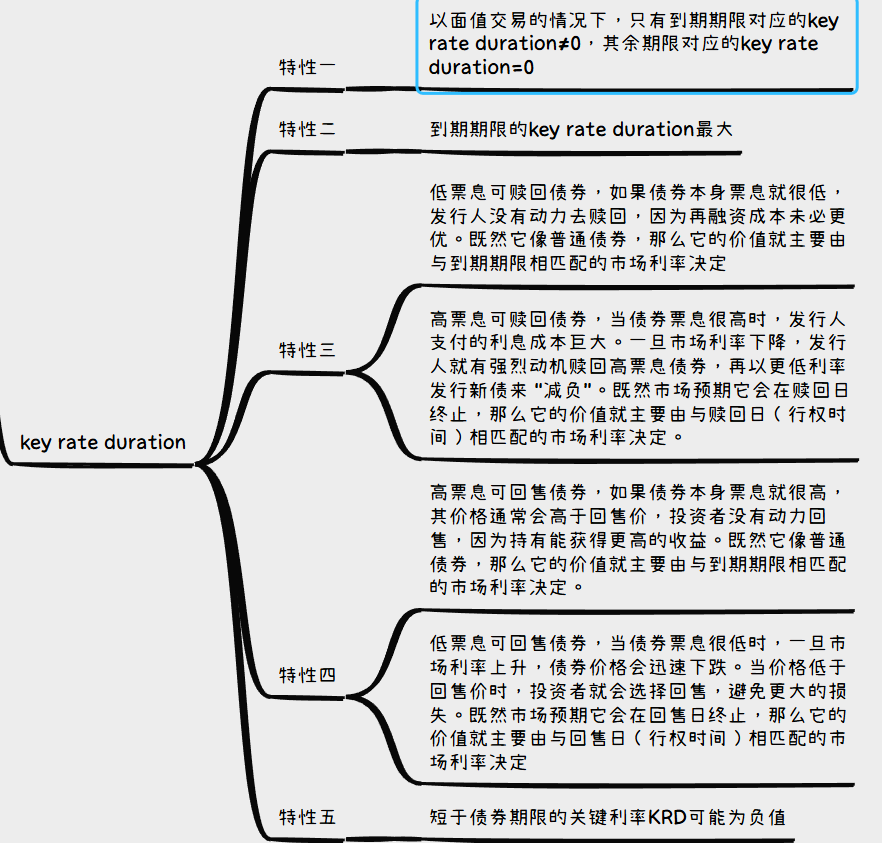
# 信用风险
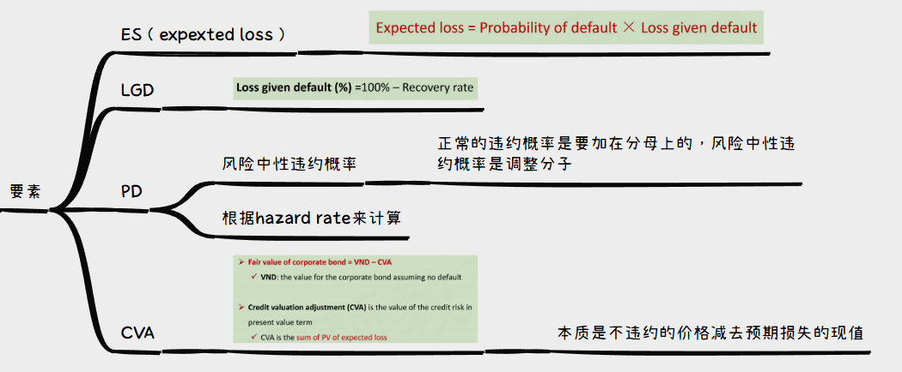
## 信用风险模型
### 二叉树（计算）

### 结构模型
因为使用了期权的思想，所以要求在无摩擦市场中才适用
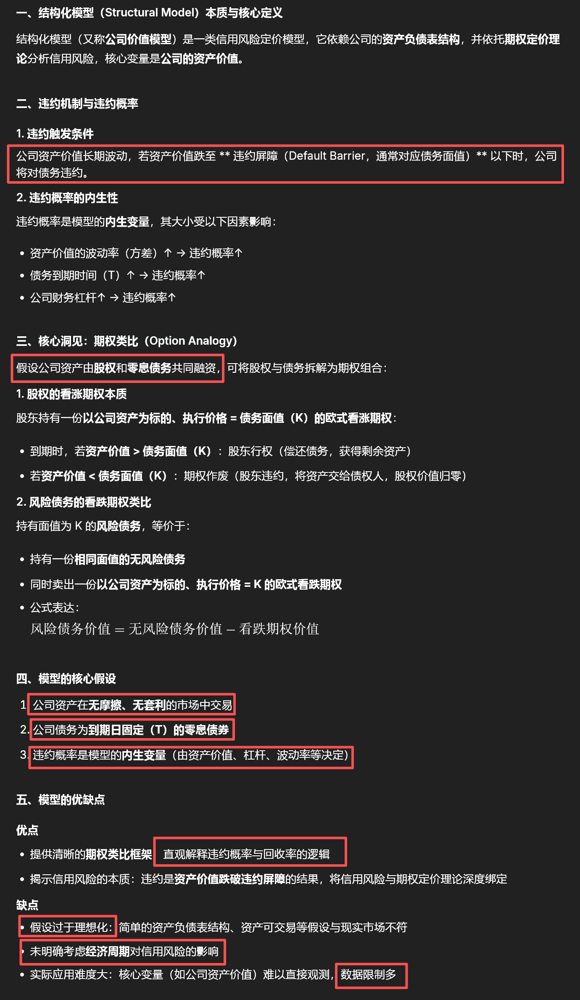
### 简化模型
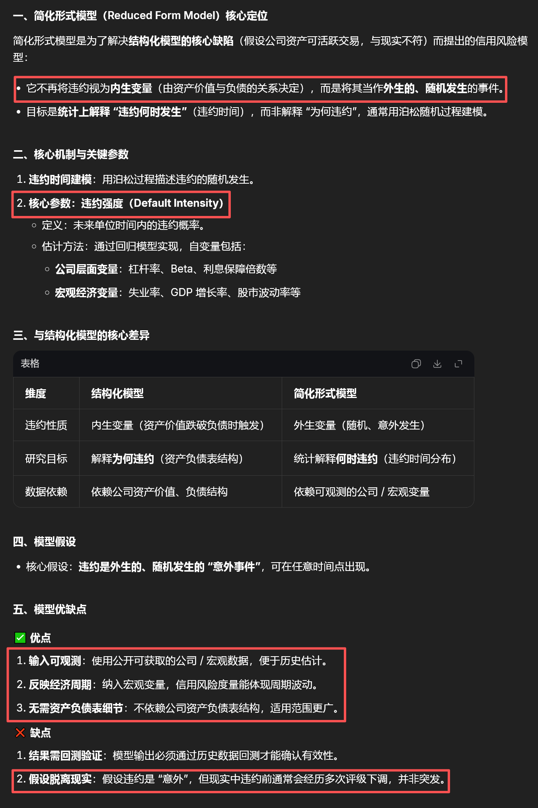
### ABS
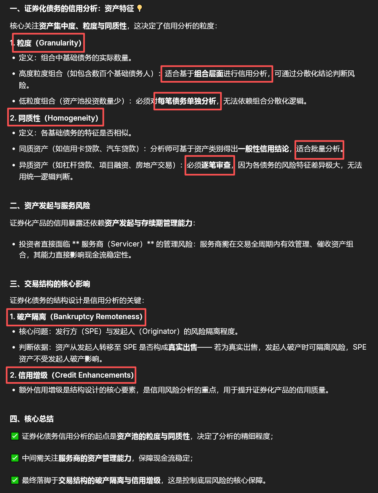

## CDS
sell CDS 是 long风险方，buy CDS 是 short 方 
### 结构
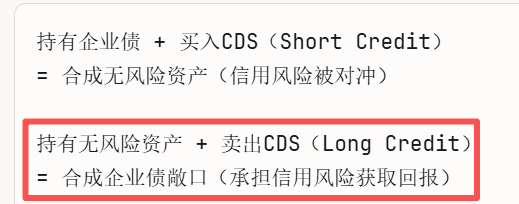
### 分类
#### single-name CDS
针对单一发行人，违约后只赔付当前层级或更高层级中金额最高的（要扣除回收率）
CDS 的赔付金额由 ** 最便宜可交割债务（cheapest-to-deliver obligation）** 决定 —— 该债务是与参考债务优先级相同、可在市场上以最低成本购买并交付的债务工具。
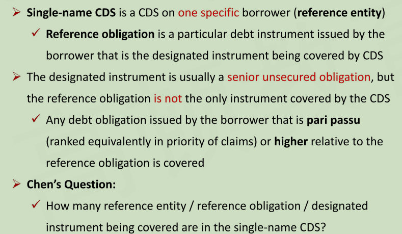
#### index CDS
针对一系列发行人，若某个逾期，则赔付一份，其他的仍在保。
组合内各公司的违约相关性越高，购买该指数 CDS 保护的成本（保费）就越高 —— 因为违约集中爆发的风险更大，信用保护卖方承担的系统性风险更高，因此保费更昂贵。
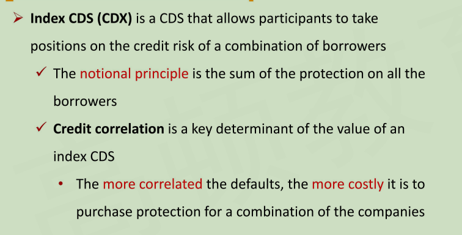

### 定价
标准费率：投资级1%，投机级5%
Upfront Premium
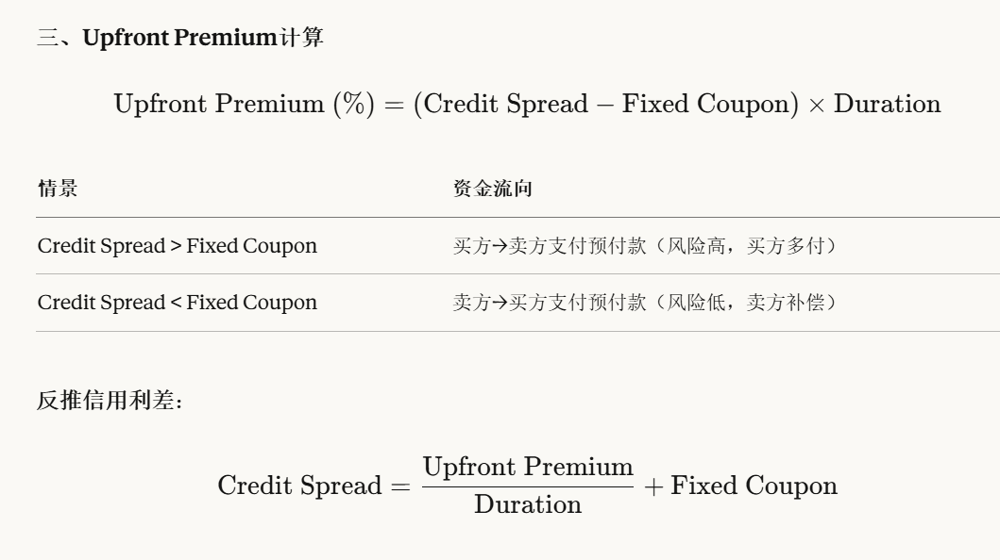
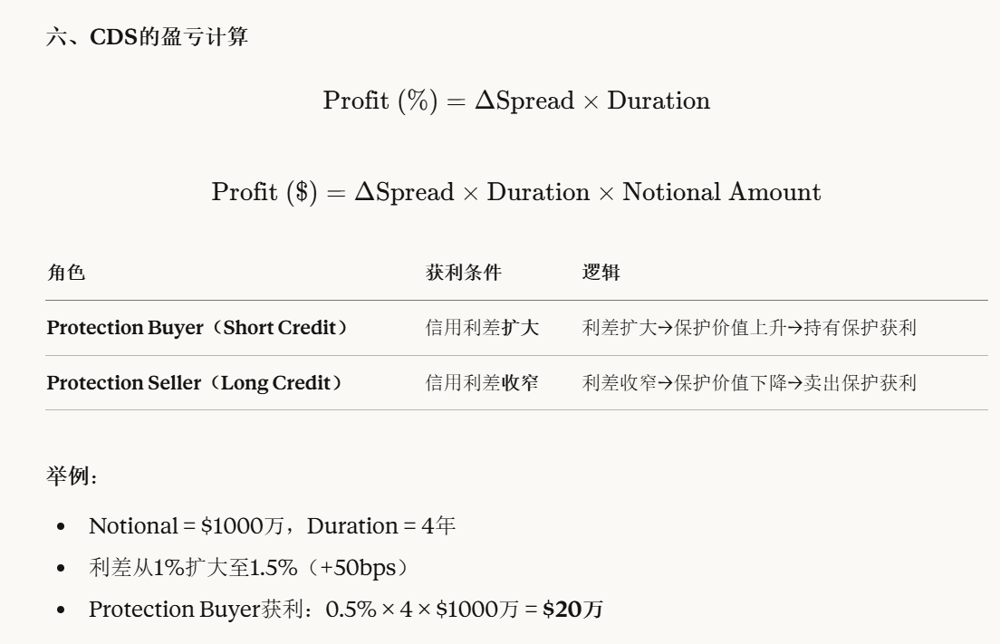
