# 远期和期货
## 定价

加成本减收益

## 估值（站在long方，用随行就市的价值减去有合约的价值）

两种计算方法：
1. 随行就市的价格减去有合约的情况下的价值再折现
2. 新合约价格减去旧合约的价格再折现

# 互换
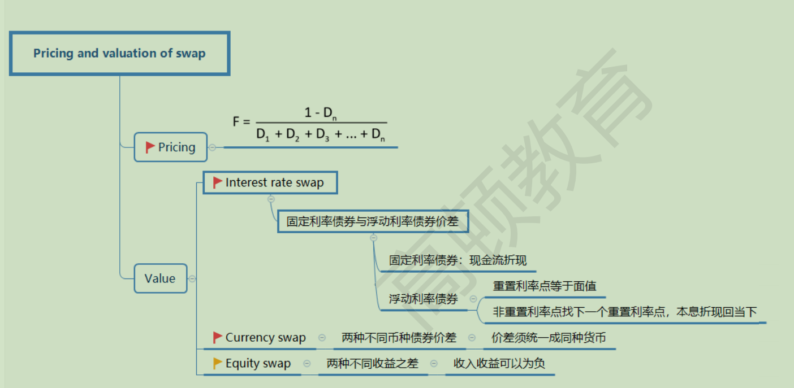
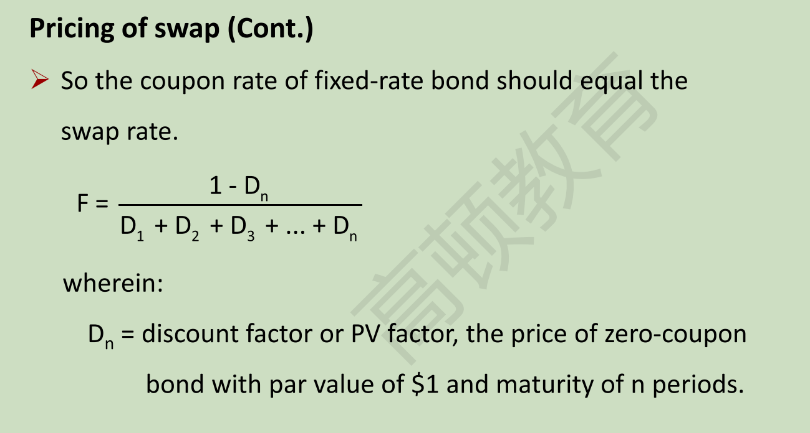
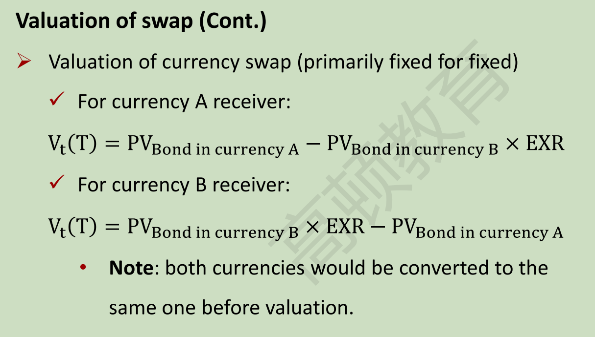
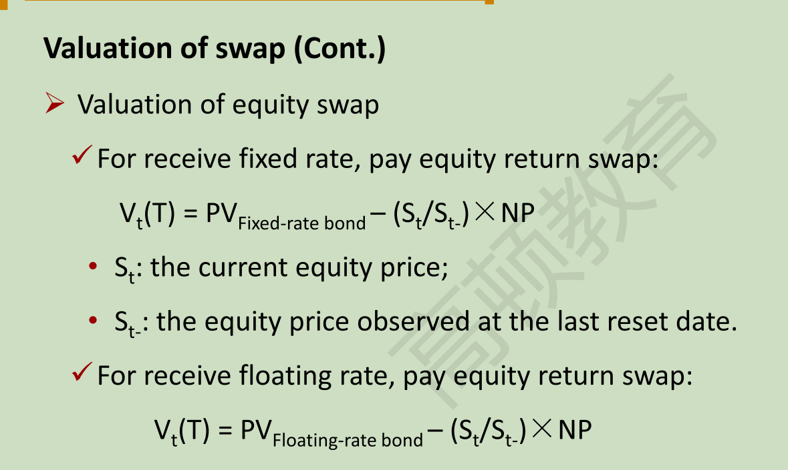
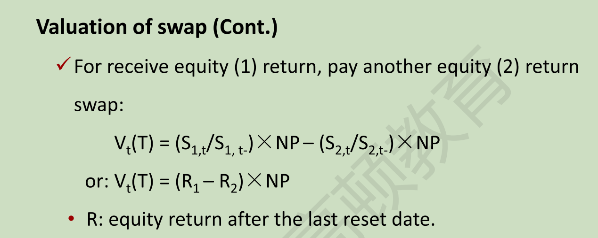

# 期权
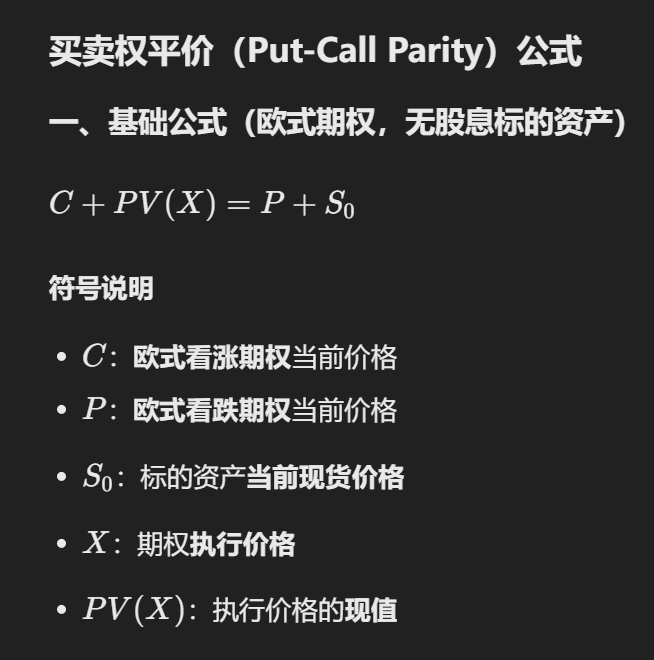
# 二叉树
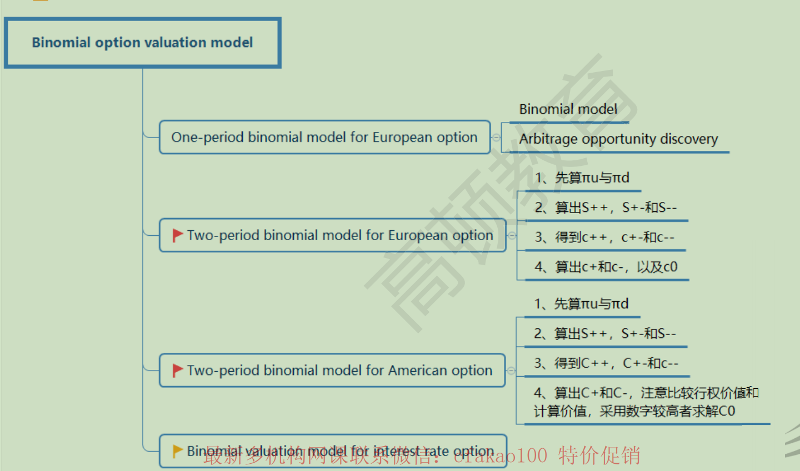
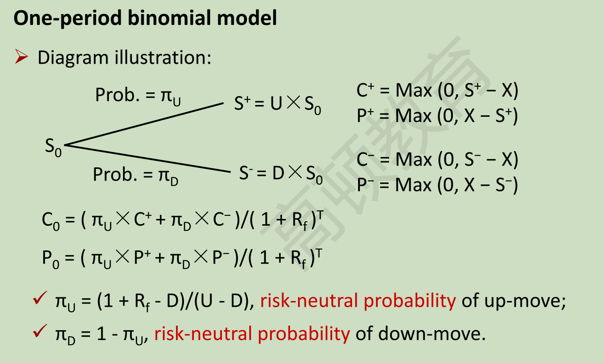

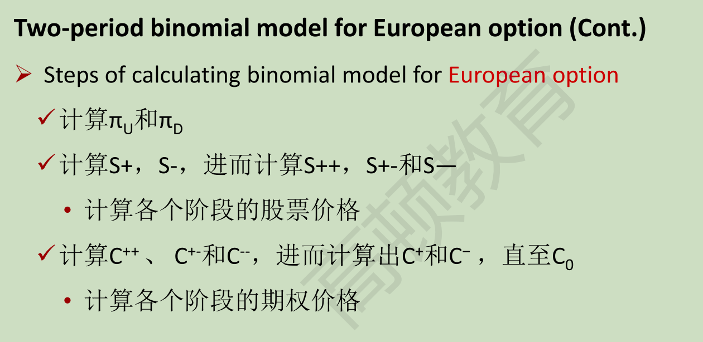
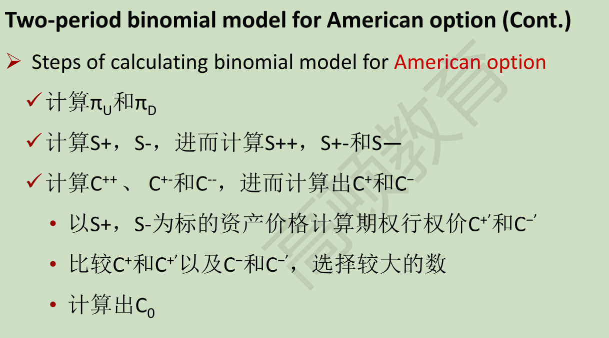
## BSM
### 前提
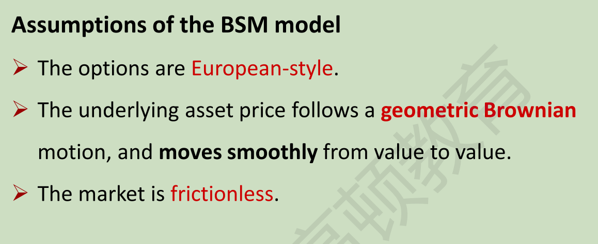
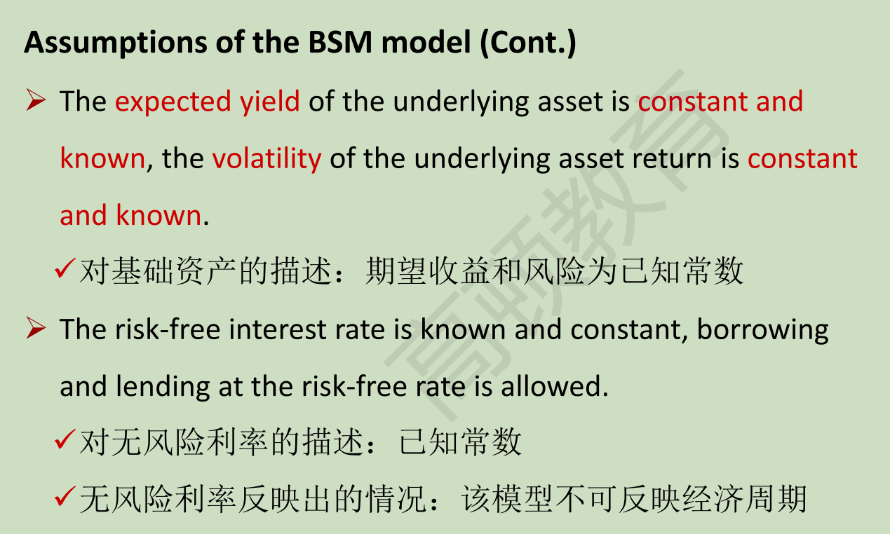
欧式期权
价格服从对数正态分布，且平滑
无费，无税，无监管
期望收益和风险是已知回报
无风险利率是常数
### 公式
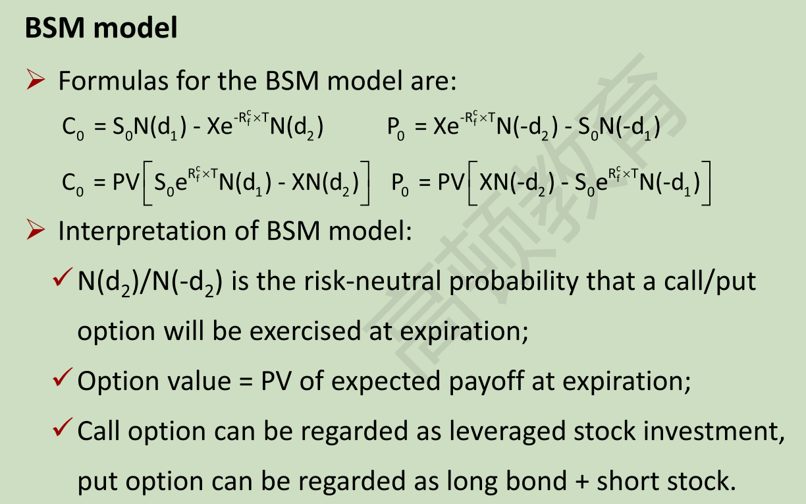

## 希腊字母
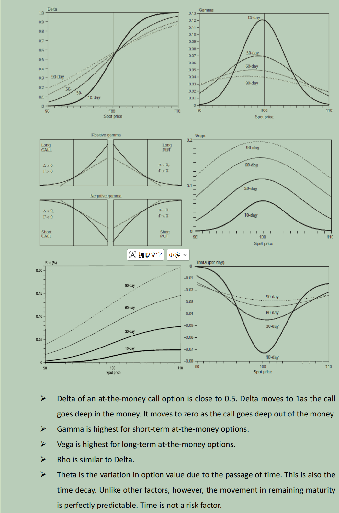
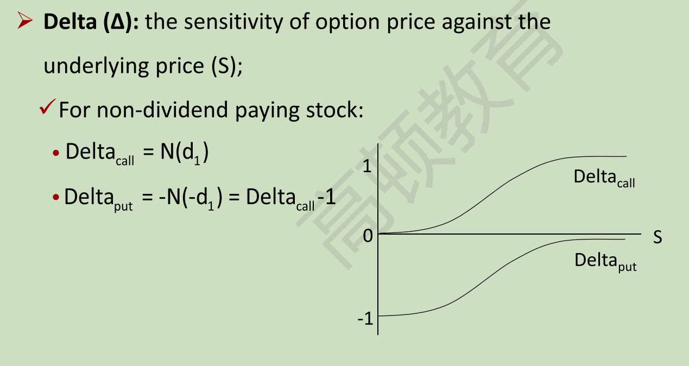
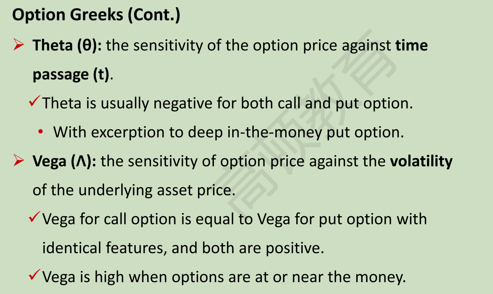
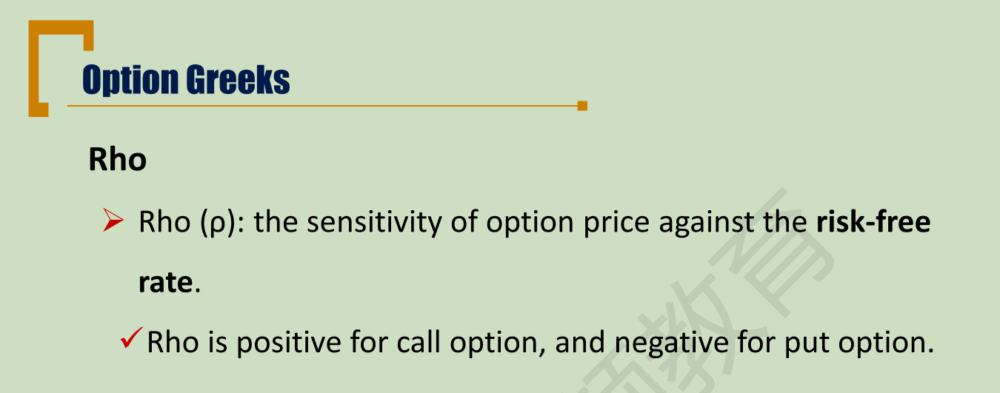

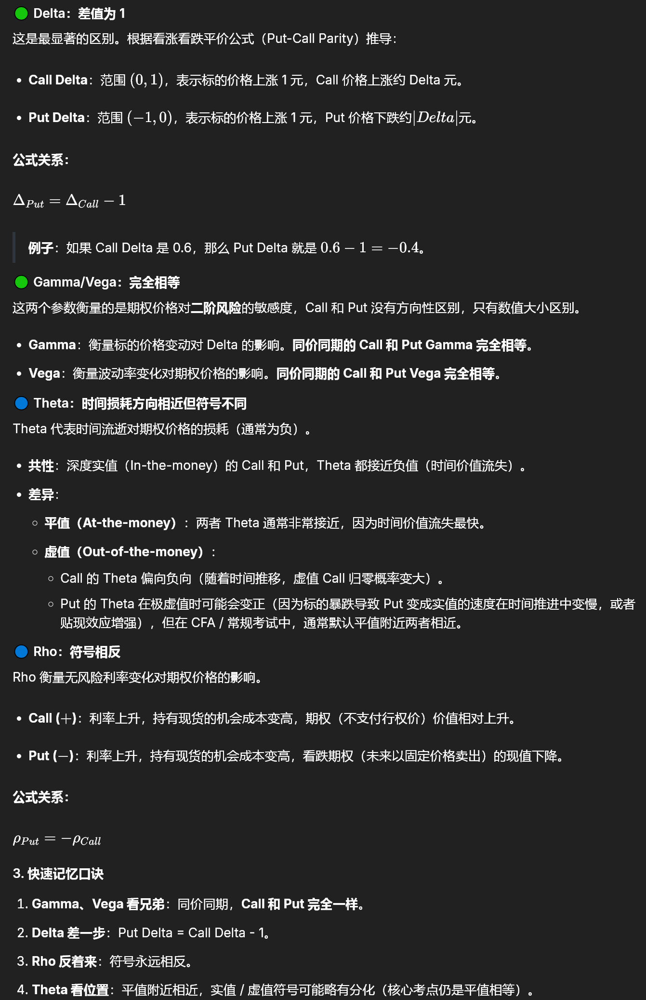
期权的delta大于0小于1，股票为1，所以对冲的话期权的数量多
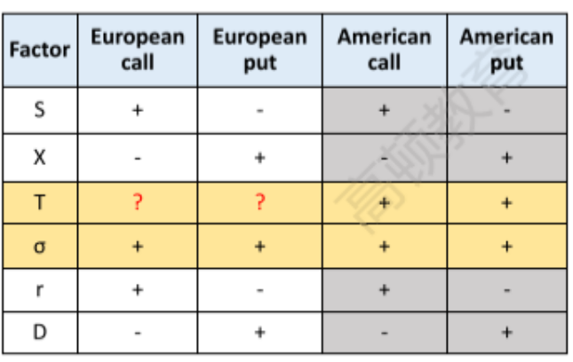
Long Call=买入Δ股股票+借入现金（Borrow cash）
Short Call=卖出Δ股票+借出现金（Lend cash）
