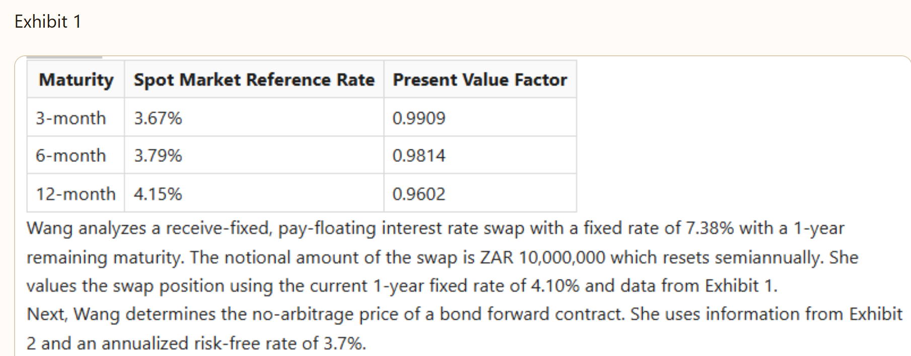
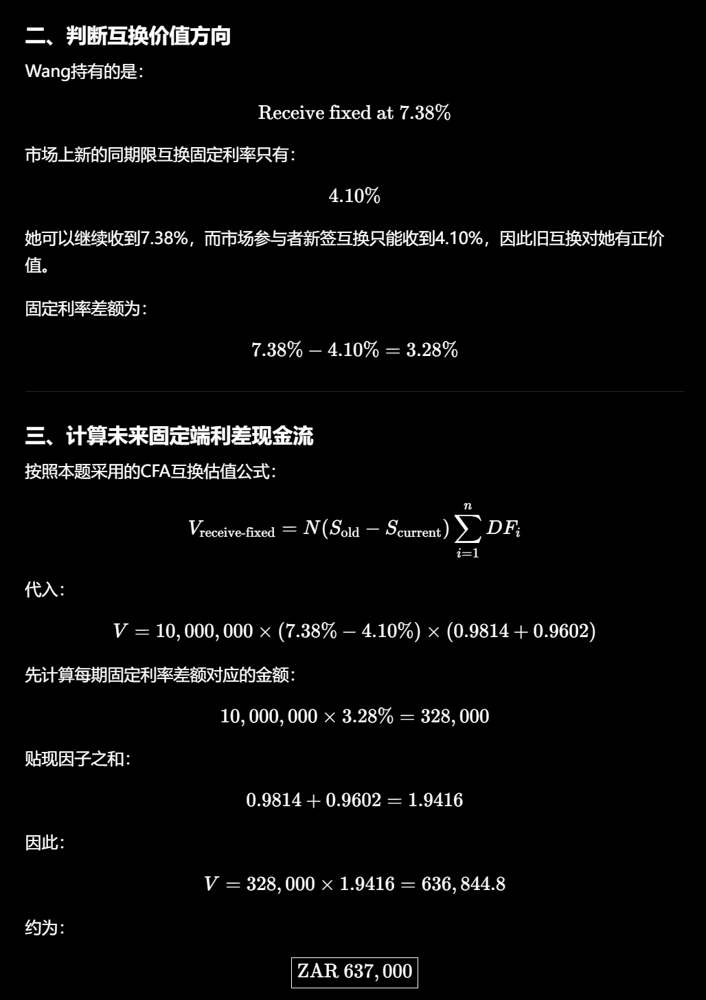
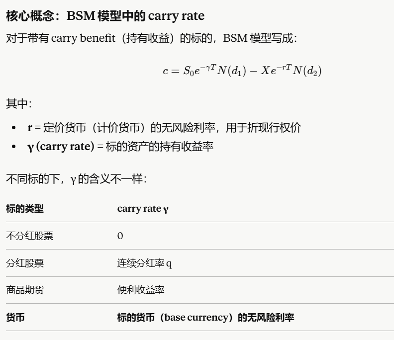
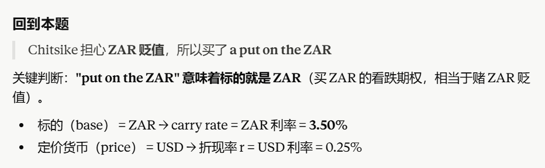
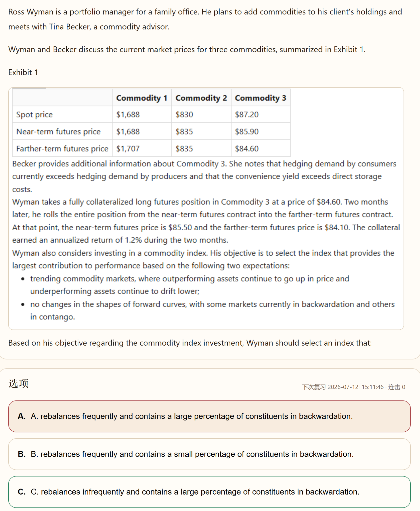
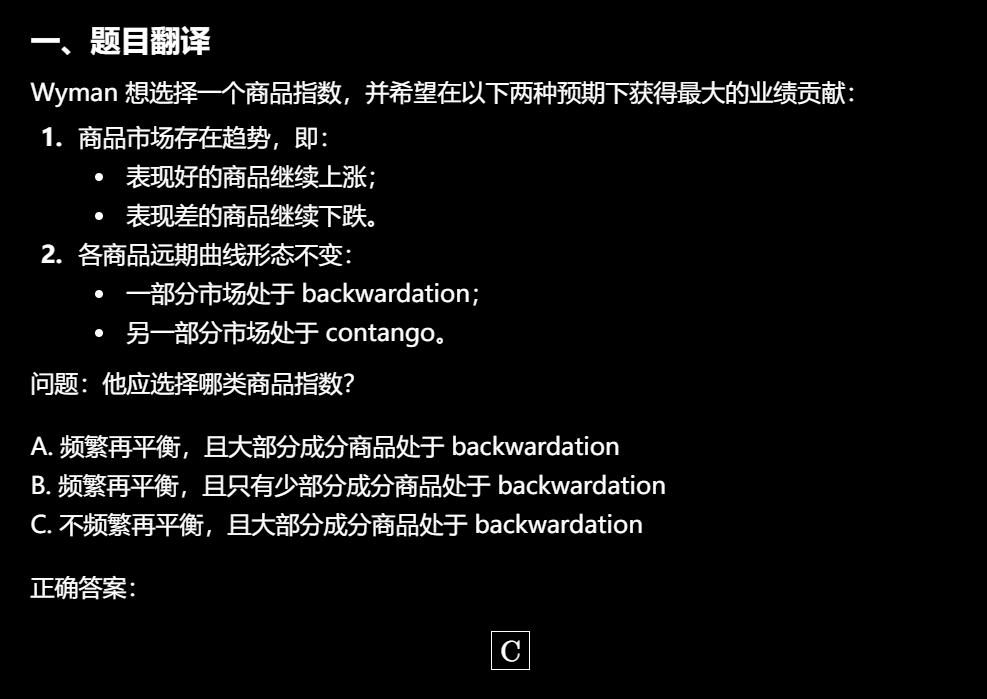
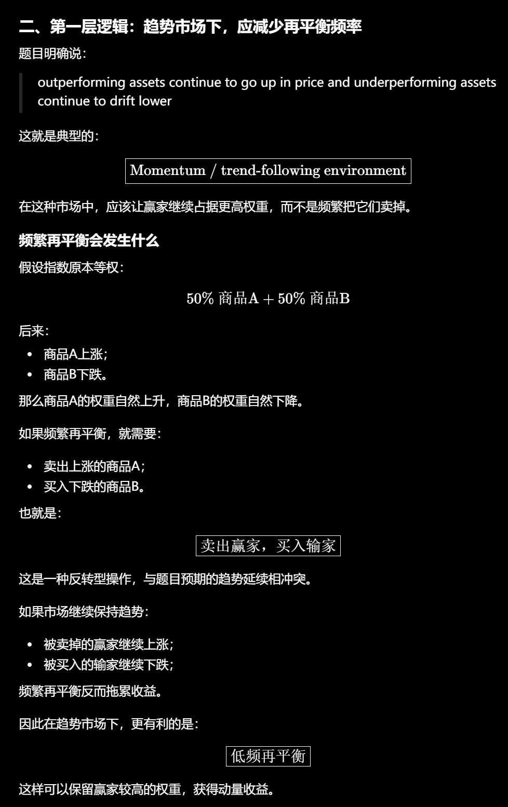
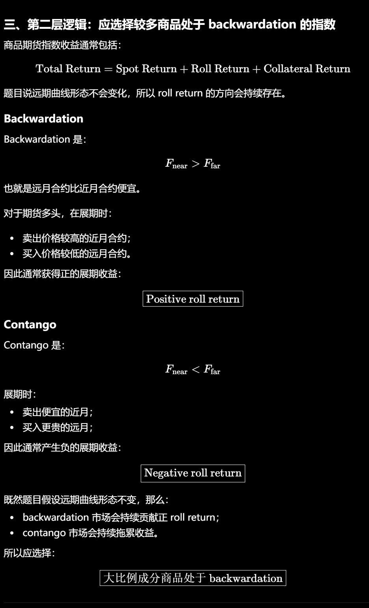

# 远期和期货
## 定价

加成本减收益

## 估值（站在long方，用随行就市的价值减去有合约的价值）

两种计算方法：
1. 随行就市的价格减去有合约的情况下的价值再折现
2. 新合约价格减去旧合约的价格再折现

# 互换

# 期权

# 二叉树

## BSM
### 前提

欧式期权
价格服从对数正态分布，且平滑
无费，无税，无监管
期望收益和风险是已知回报
无风险利率是常数
### 公式

**看涨期权 (Call) 价格：**

$$C_0 = S_0 \cdot N(d_1) - X \cdot e^{-R_f^c \cdot T} \cdot N(d_2)$$

**看跌期权 (Put) 价格：**

$$P_0 = X \cdot e^{-R_f^c \cdot T} \cdot N(-d_2) - S_0 \cdot N(-d_1)$$

**其中 $d_1$ 和 $d_2$：**

$$d_1 = \frac{\ln\left(\frac{S_0}{X}\right) + \left(R_f^c + \frac{\sigma^2}{2}\right) \cdot T}{\sigma \cdot \sqrt{T}}$$

$$d_2 = d_1 - \sigma \cdot \sqrt{T}$$

| 参数 | 含义 |
|------|------|
| $S_0$ | 标的资产当前价格 |
| $X$ | 行权价格 (Strike Price) |
| $T$ | 距到期时间（年化） |
| $R_f^c$ | 连续复利无风险利率 |
| $\sigma$ | 标的资产收益率的年化波动率 |
| $N(\cdot)$ | 标准正态分布的累积分布函数 (CDF) |

**$N(d)$ 的经济含义：**
- $N(d_1)$：对冲比率 (Delta)，即期权价格对标的资产价格变动的敏感度
- $N(d_2)$：期权到期时处于**实值**（价内）的风险中性概率

**买卖权平价 (Put-Call Parity)：**

$$C_0 - P_0 = S_0 - X \cdot e^{-R_f^c \cdot T}$$

### 期货期权 (Black 模型 / Black-76)

标的资产为**期货合约**时，使用 Black 模型定价。核心差异：期货合约初始价值为零，且期货价格已隐含持有成本（cost of carry），因此 $d_1$ 分子中**不含无风险利率**。

**期货看涨期权 (Call on Futures)：**

$$C_0 = e^{-R_f^c \cdot T} \cdot \left[ F_0 \cdot N(d_1) - X \cdot N(d_2) \right]$$

**期货看跌期权 (Put on Futures)：**

$$P_0 = e^{-R_f^c \cdot T} \cdot \left[ X \cdot N(-d_2) - F_0 \cdot N(-d_1) \right]$$

**其中 $d_1$ 和 $d_2$：**

$$d_1 = \frac{\ln\left(\frac{F_0}{X}\right) + \frac{\sigma^2}{2} \cdot T}{\sigma \cdot \sqrt{T}}$$

$$d_2 = d_1 - \sigma \cdot \sqrt{T}$$

| 参数 | 含义 |
|------|------|
| $F_0$ | 期货合约当前价格 |
| $X$ | 行权价格 |
| $T$ | 距到期时间（年化） |
| $R_f^c$ | 连续复利无风险利率 |
| $\sigma$ | 期货价格的年化波动率 |

**期货期权 Put-Call Parity：**

$$C_0 - P_0 = (F_0 - X) \cdot e^{-R_f^c \cdot T}$$

**⚡ 现货 BSM vs 期货 Black 关键区别：**

| 对比项 | 现货 BSM | 期货 Black |
|--------|----------|------------|
| 标的资产 | $S_0$（现货价格） | $F_0$（期货价格） |
| $d_1$ 分子 | $R_f^c + \frac{\sigma^2}{2}$ | $\frac{\sigma^2}{2}$（无 $R_f^c$） |
| 折现方式 | 仅行权价 $X$ 折现 | 整个括号整体折现 $e^{-R_f^c \cdot T}$ |
| 原因 | 现货需考虑购买成本 | 期货建仓成本为零，持有成本已隐含在 $F_0$ 中 |

## 希腊字母

期权的delta大于0小于1，股票为1，所以对冲的话期权的数量多

Long Call=买入Δ股股票+借入现金（Borrow cash）
Short Call=卖出Δ股票+借出现金（Lend cash）

