# 股权投资

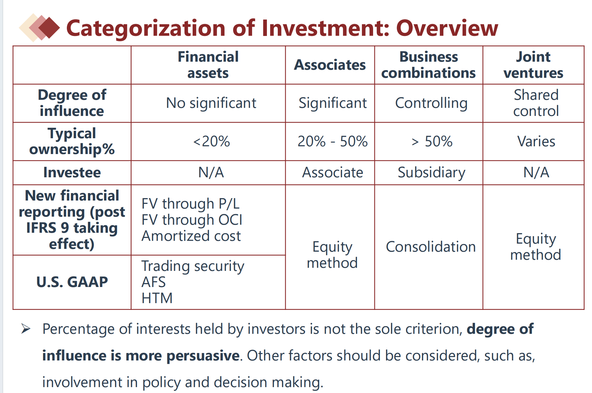
## 金融资产
### 金融资产核算
三种金融工具核算方法
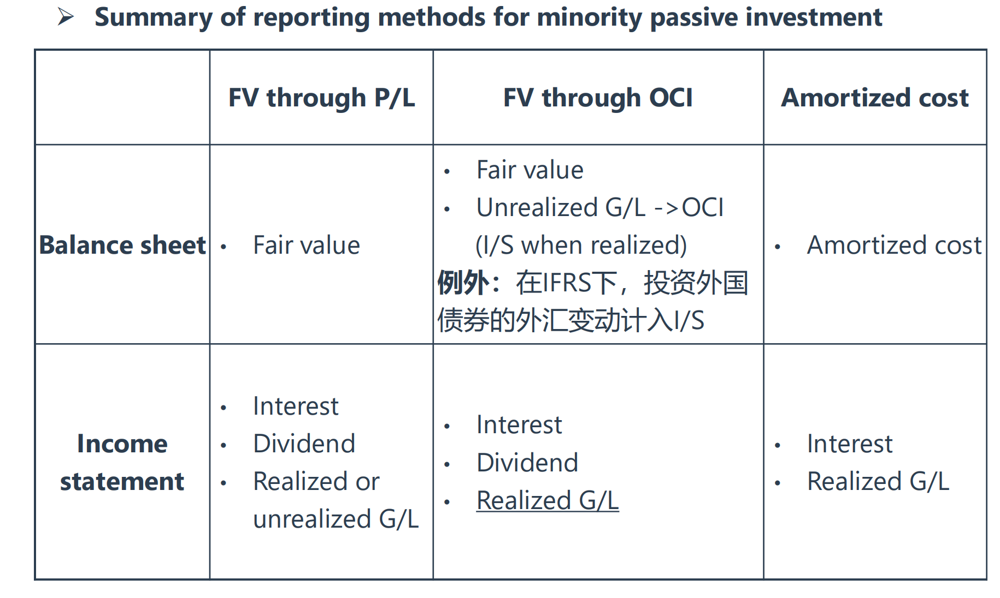
FVPL：价值和公允价值一致，已实现和未实现的损益都计入当期损益，进利润表
FVOCI：价值和公允价值一致，已实现利润进利润表，未实现损益进OCI
AC：一定是一个债券

### 金融资产分类
AC：只有债券才能被分到这里（条件一：持有至到期。条件二：只有本金和利息，不会提前卖出）
FVPL：持有的目的是为了交易，或者mismatch的情况
FVOCI：结余中间

**过程中意图改变进行重分类reclassification（只设计债券，只有AM和FVPL之间换）**
AM-FVPL：账面价值从摊余成本变公允价值，gain和loss进利润表
FVPL-AM：gain和loss调出利润表

## asociates（联营企业，权益法计算）
**实质重于形式，怎么看有重大影响**
符合下面的情况认为有重大影响：
1.董事会有席位
2.可以参与决策
3.有重大交易
4.双方高管重叠
5.技术依赖性
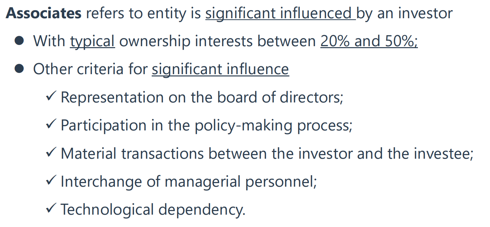

### 权益法计算
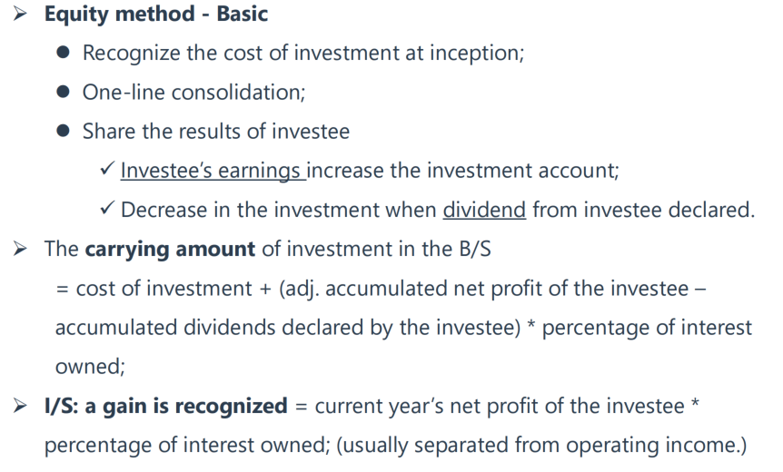
案例：A收购B30%的股权，
资产负债表：
**基本公式:A长期股权投资科目+B的净利润*30%（乘比例）（本期增加数）- 发放现金股利乘比例（本期减少数）**
利润表：
确认净利润乘比例

#### 1.如何对长期投资科目进行拆分
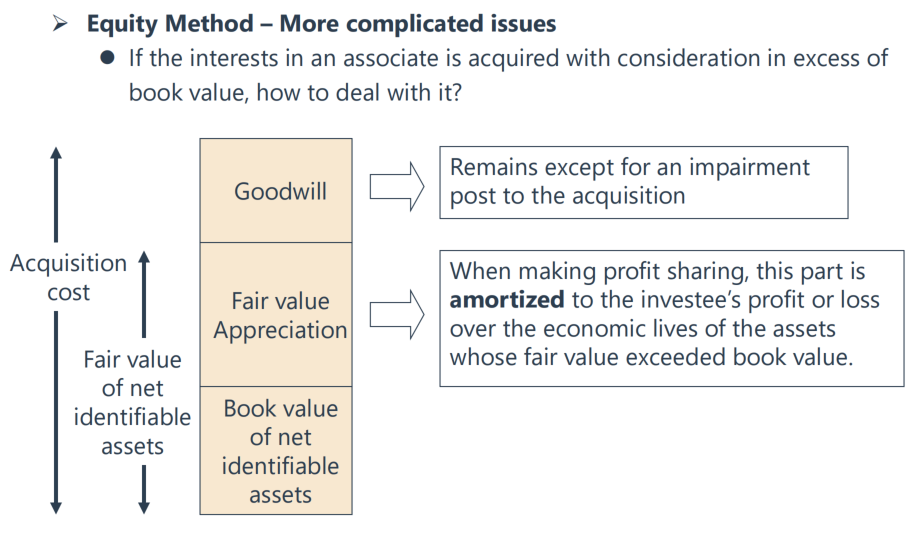

#### 2.本期增加数中：要使用公允价值的净利润来计算（账面价值调成公允价值）
BV-FV一般考三个科目，调整后是公允价值NI
- 存货：资产负债表上调整后，会影响利润表的COGS
- 固定资产：会影响折旧费用
- 无形资产：会影响摊销费用

#### 3.投资方和被投资方至今的内部交易
内部交易要剔除这部分利润
内部交易后又对外销售，实现了利润，将没有实现的部分减去

#### 其他
权益法的另外计算方法：通过公允价值计量（如果没天都能拿到公允价值）
GAAP下可以，IFRS下只有一些信托等每天更新净值的才能公用，选了这个方法就得一直用这个方法，不能换

收购公司之后，如果发生风险，需要减值
IFRS下将账面价值和可回收金额作对比MAX（卖掉的价值VS持有价值），利润表上确认减值损失。
GAAP下将公允价值和账面价值直接对比。公允价值：1.市场价值2.类似公司价值3.估值模型
不管什么准则计提减值后不能返回！！

## controlling（合并报表，避开了最困难的合并抵消）
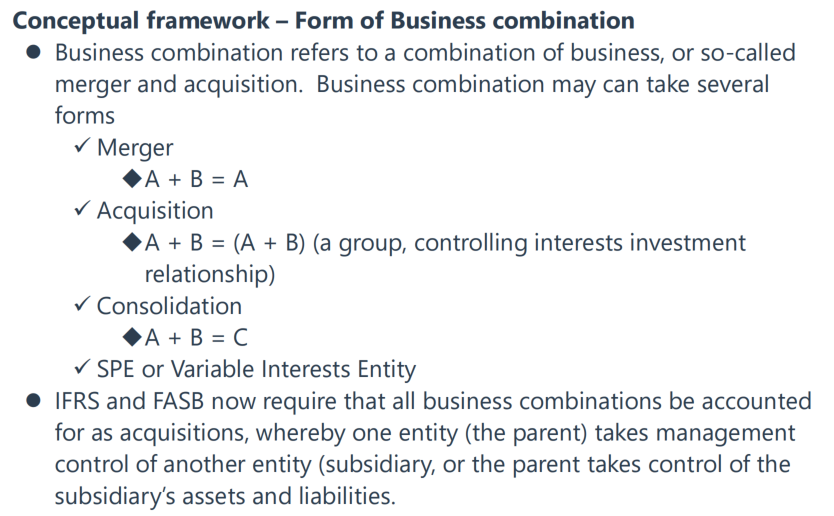
吸收合并，新设合并：不需要并表
收购：才需要并表

### 资产负债表合并
**被收购方的资产负债表应该是公允价值**。不管持股比例多少，都完全合并。
#### 少数股东权益
- 资产：要减去现金（现金为被收购方权益乘比例），这样的话就会多出来一块，就是少数股东权益（记在权益处）。
- 负债：直接加
- 权益：不合并（资产负债处已经合并了）

#### 商誉
溢价收购，超过公允价值的溢价部分要记为商誉
核算方式：
全商誉：倒算出来，多的部分加到少数股东权益中
部分商誉：实际持股比率
### 利润表合并考的少
#### 1.如何把子公司利润表从BV变为FV（这个相对重要）
调利润表就是来调资产负债表（和上面计算本期增加数是一样的）
- 存货：资产负债表上调整后，会影响利润表的COGS
- 固定资产：会影响折旧费用
- 无形资产：会影响摊销费用

#### 2.利润表合并有时间要求
例如八月合并，只合并收购之后的部分

#### 3.如果收购比例不是100%
需要加上科目，属于少数股东的净利润（净利润乘上少数股东比例），中国叫归母净利润）

## 单独讨论的问题
### 商誉（重点在减值）
#### 如何判断减值
考试时先算partial，在倒乘为full
商誉的减值是要去测拟收购的那家公司。将收购的公司的账面价值和公允价值作对比
GAAP：只能用full 商誉
IFRS：full和partial都可以

负商誉：利润表上直接记为投资收益。

#### IFRS准则下的商誉减值
减值判断标准：当现金产出单元（含商誉）的账面价值 > 可回收金额时需计提减值
可回收金额确定：取公允价值减处置费用()和使用价值()两者较高者
减值处理顺序：
1.首先全额冲减商誉账面价值
2.商誉减至零后，剩余损失按比例分摊至其他非现金资产
#### US GAAP准则下的商誉减值
第一步：减值识别：
比较报告单元账面价值(含商誉)与公允价值
当账面价值 > 公允价值时确认减值
第二步：减值计量：
减值损失 = 商誉账面价值 - 隐含公允价值
最大减值限额为商誉的账面价值
核心区别：US GAAP不允许商誉减至零后继续分摊至其他资产

## 合营企业
基本概念：合营企业（Joint Venture）是指被两家或以上公司共同控制的企业，例如A公司和B公司各持有C公司50%股权时，C公司即为合营企业。
核算方法：
- 主要方法：权益法（Equity Method），适用于绝大多数情况，与国际会计准则（IFRS）和美国通用会计准则（US GAAP）要求一致。
- 特殊方法：比例合并法（Proportionate Consolidation），仅在极少数情况下允许使用，需满足严格条件。
### 比例合并法
操作方式：
将被投资企业的各项资产、负债、收入和费用按持股比例（如50%）计算后合并
例如：B公司报表各科目乘以50%后与A公司合并

### 方法对比
**核心结论：无论采用权益法(equity)、收购法(acquisition)还是比例合并法(proportionate)，合并后净利润(net income)相同**
原因分析：
- 权益法：仅确认投资收益60×80%=48
- 收购法：100%合并利润60后需扣除少数股东权益12（60×20%）
- 比例法：按持股比例合并60×80%=48
记忆要点：三种方法最终净利润均为48，差异仅体现在合并过程中
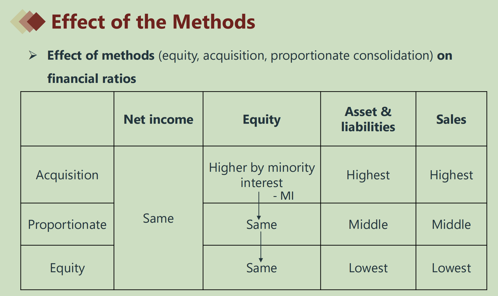

## SPE与VIE
### SPE

### VIE
定义: 可变利益实体(Variable Interest Entity)
产生背景: 安然事件后US GAAP引入的新规
三条判断标准(符合任一即需并表):
- 决策能力缺失: SPE的决策实际由母公司做出
- 风险承担缺失: SPE的亏损实际由母公司承担
- 收益权缺失: SPE的收益实际由母公司享有

# 员工薪酬（养老金、股权激励）
## 员工薪酬构成
1. 短期福利：预期在12个月内支付的薪酬
常见形式：基本工资、年度奖金、医疗保险等非货币福利、社保缴纳、带薪休假
2. 长期福利：预期支付周期超过12个月的薪酬
典型例子：长期休假（如学术休假）、长期伤残福利
3. 终止福利：员工离职时支付的补偿
包含：遣散费、延续医疗福利、职业咨询服务
4. 股权激励：以公司股票为形式的薪酬
主要类型：限制性股票、股票期权
5. 退休后福利：员工退休后支付的补偿
具体形式：养老金、一次性退休金、退休人员人寿保险

### 生效概念(Vesting) 
定义: 员工获得补偿权利的过程，使雇主产生支付义务
三阶段流程:
- 授予(Grant): 公司向员工授予股权/期权
- 生效(Vesting)**确认时间**: 满足条件后权利生效
- 结算(Settlement): 员工行使权利变现
目的: 防止立即变现，确保激励效果
例子：
期权: 可行权购买股票
限制性股票: 可出售变现

### 员工薪酬会计处理
资本化处理 
特殊情形：生产人员薪酬，计入存货成本（料工费中的"工"）
后续结转：存货销售时转入COGS
可销售状态前支出资本化，可销售状态后支出费用化
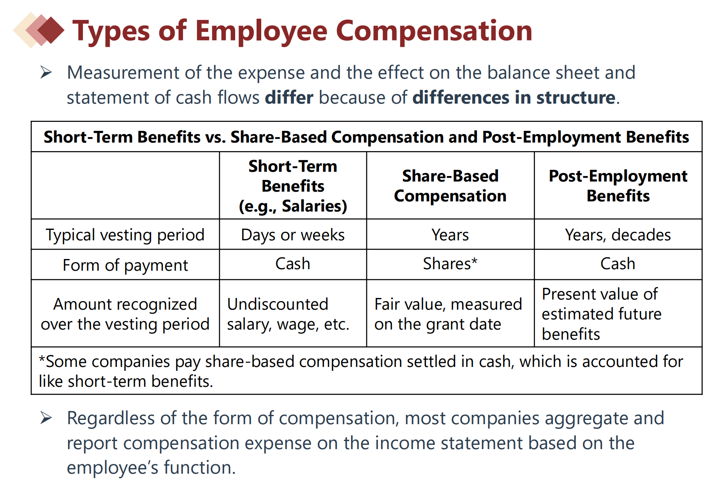
生产人员：计入COGS
管理人员：计入G&A
销售人员：计入Selling expense

## 股权激励
### 规则
通过将员工利益与股东利益绑定，解决委托代理问题（agency problem）
典型结构：设置3-5年归属期（vesting period
#### 优势
使管理层与股东目标一致，减少短期行为
归属期要求能有效降低核心员工流失率
不产生即时现金支出，改善公司流动性
#### 劣势
员工表现与股价可能脱节（如熊市时优秀员工仍会亏损）
保守倾向：管理层回避必要风险以防股价下跌
激进倾向：为追求期权收益过度冒险（尤其期权具有收益不对称性）
股份稀释导致EPS下降，可能触发股票回购需求，需要支付额外现金

需要披露激励性质（具体的类型）和范围，激励的成本，公允价值披露 ，对公司账面经营的影响披露 （利润，税务，EPS），一般在报表附注披露。
### 工具（前两个重要）
**1. 限售股(Restricted Stock):**
特点：授予真实股票，有投票/分红权但限售
变体：RSU（虚拟股票单位，无投票权，避免限售股有投票权的问题）
#### 限售股的会计处理
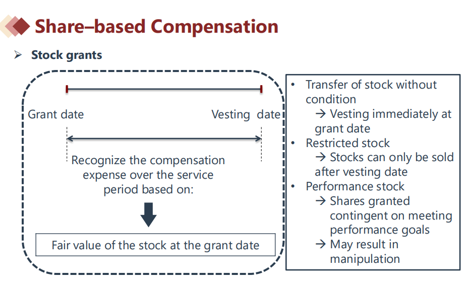
在vesting date之中分摊
**2. 股票期权(Stock Options):**
类型：不可交易的看涨期权，用估值模型来计算（没有要求要什么模型）
行权价：授予日平价(at the money)
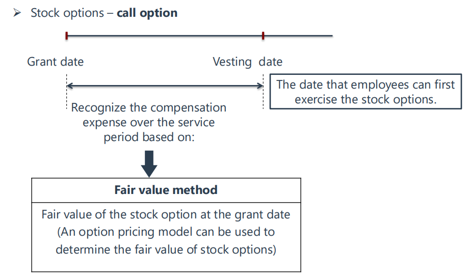
也是在vesting date之中分摊，vesting date是可以行权的事件，不是实际行权的事件
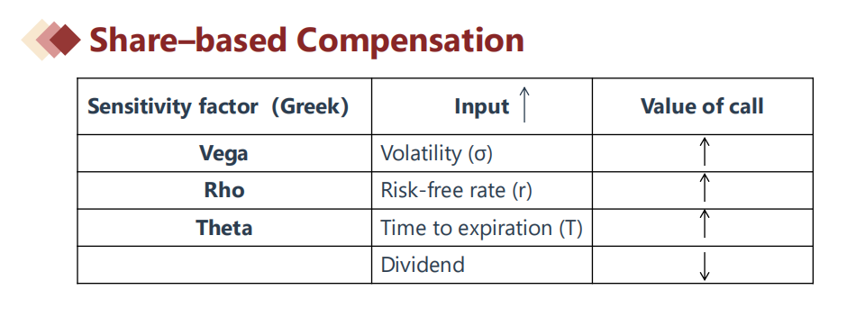
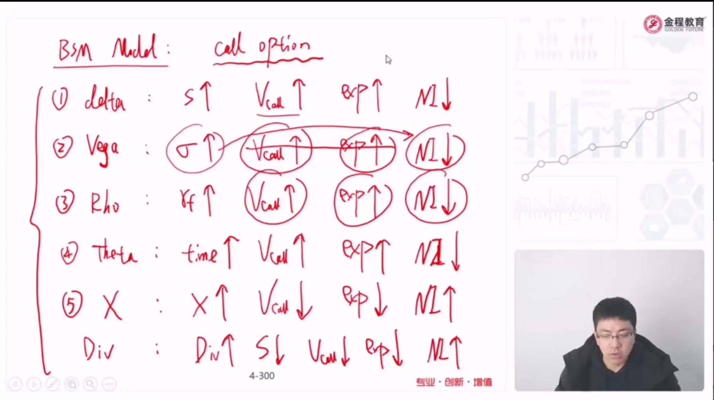
分红越多，会导致股票下降，call option下降。
**激励成本高，净利润就会下降**
rho用put-call parity，时间越长期权时间价值越大。

期权送给员工，确认expense，利润下降，可以少交税，但是对equity没有影响，会对冲。
使用授予日的公允价值进行计量

3. 股票增值权(SARs):
特点：现金结算股价增值部分
变体：幽灵股(Phantom Shares)
4. 员工购股计划(ESPP):
特点：折价认购新股（考试较少涉及）
### 和短期工资奖金不同
1. 核算方式:
短期薪酬：通过负债科目核算（如应付工资），到期现金结算
股权激励：通过权益科目核算，用授予日公允价值计量，以股份结算，一般会分摊。
2. 时间跨度:
短期薪酬：1年内支付
股权激励：多年生效（如3-5年）
3. 计量基础:
短期薪酬：记一个工资费用，净利润下降，留存收益下降，equity下降，liability上升。
股权激励：授予期权，在授予日公允价值核算成本，记为费用，净利润下降，课程实验下降，equity下降，但是增加了paid in captial，也是equity项目，equity综合不变。
4. 生效条件:
短期薪酬：仅需完成服务期
股权激励：需满足服务年限+业绩指标（如股价/EPS目标）

### 股权激励对税收的影响
会计口径会进行分摊，税务报表会在兑现时才一次性确认成本。
会计口径是按照授予日的市场价值核算，税务口径按照实际结算的价值来计算成本。

例如：结算的要比授予的时候价格更高，税务报表上确认的成本更高，意味着利润更低，可以少交税。反之要多交税。**而且不会形成递延所得税**。

- IFRS准则:
税收差异产生的损益直接计入股东权益(Other Comprehensive Income)
- US GAAP准则:
税收差异产生的损益计入当期利润表(影响所得税费用)

### 股权激励对公司的股数的影响（使用库存股法）
主要是两种情况：期权行权（option），RSU（虚拟股票单位）。
库存股法：员工行权时会产生现金，这些现金会到市场上进行回购，最后计算净增加。
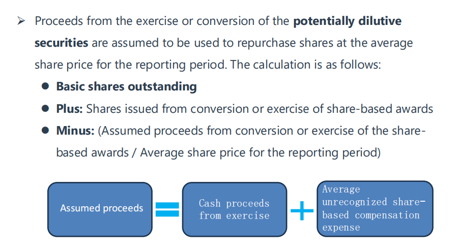

针对回购要进行说明
回购股票的钱不仅是员工行权收到的现金，而是assumed proceeds。由框部分构成：一部分是真实收到的现金，还有一部分是还没有行权的费用作为收益（谨慎性原则）

### 反稀释
价外期权效应：当平均股价<执行价（如5<10），员工行权后公司增发1股（收10）可回购2股（10/5），总股数净减1股，形成反稀释
现实意义：价外期权理论上反稀释，但实务中员工不会行权，故实际不会出现反稀释情况
当稀释后的每股收益大于基本每股收益时，使用基本每股收益

**稀释后EPS（Diluted EPS）不得高于基本EPS（Basic EPS）**

正常情况：RSU通常具有稀释性，因行权时直接增加流通股数（无现金流入）
反稀释条件：当报告期平均股价显著低于授予日股价时：
原因：未确认薪酬费用按授予日股价计算（如授予日股价20，当前5）
机制：高额未确认费用（20×股数）可回购更多股份（20N/$5=4N），可能超过RSU增发数量
**需要考虑的情况：**
- 亏损企业：
典型行业：科技类创业公司（如未盈利的早期科技企业）
原因：现金短缺导致薪酬结构以股权激励为主（股份支付占比极高）
影响：这类公司反稀释可能性显著高于盈利企业
- 股价剧烈波动：
价格下跌效应：授予日后股价大幅下跌会增强反稀释效果
波动性影响：股价波动越大，产生反稀释效果的概率越高
量化关系：股价下跌幅度与反稀释强度呈正相关

会计上不考虑反稀释，但是研究者估值时需要考虑

### 股权激励的报表建模
使用场景：计算公司的自由现金流（不涉及现金流的要加回），股权激励看做非现金流
计算nan-gaap metrix

股数预测：
年初股数 + 行权增发股数 - 回购股数 = 年末股数
需预测授予日数量(扣除没收部分)和结算日数量
根据历史数据估算授予增长率和结算比例

## 养老金
DC账户是员工自己管理（现金下降，利润表计费用，净利润下降），重点是考DBplan，DB是公司来管理（一般交退休前工资的固定比例）（会计核算更复杂，未来应该支付还没有支付的部分体现在资产负债表上，负债需要精算出来，同步要把养老金资产准备出来），OPB是退休之后医疗的钱。
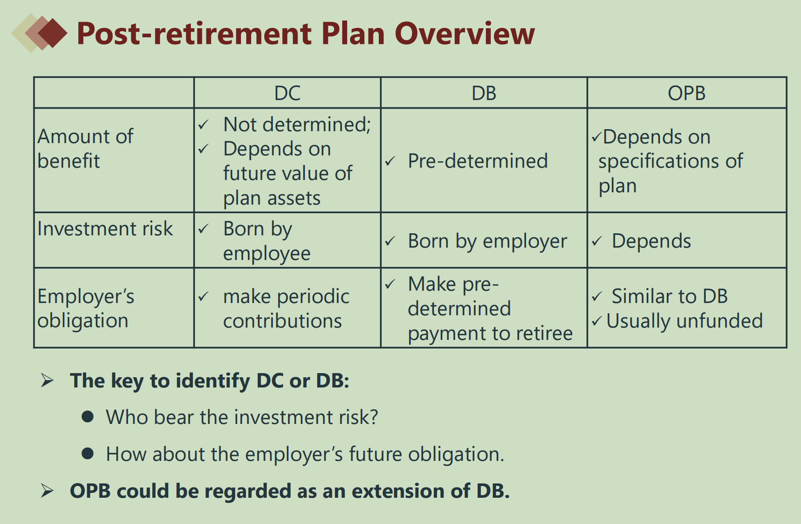

## 核算
### 资产负债表
PBO/PVDBO：预计未来将要支付的养老金的现值（基于退休前的工资水平）
ABO：和上面的一样（按照当前实际的工资水平俩计算的）
VBO：在ABO的基础上加上了vesting的条件

#### PBO的计算（负债）
1. 首先要画一个时间轴，三个关键时点：当前时点，预计退休时点，去世时点。我站在当前时点无法确认退休前的工资，所以要加入精算假设。
2. 预算：假设退休前工资（直接告诉或者告诉周转率），假设员工的寿命，假设折现率。 
3. 计算：分两段折现：先将退休后现金流折现到退休时点，再从退休时点折现到现在。每年正常来说都要按照上面的方式重算PBO，很麻烦，使用简便方法（Annual unit credit，退休时点的现值成倍数增长）
4. 可以通过PBO除以未来工资和当前工资的倍数就能算出ABO
5. PBO是累计数，Current service cost：时点数
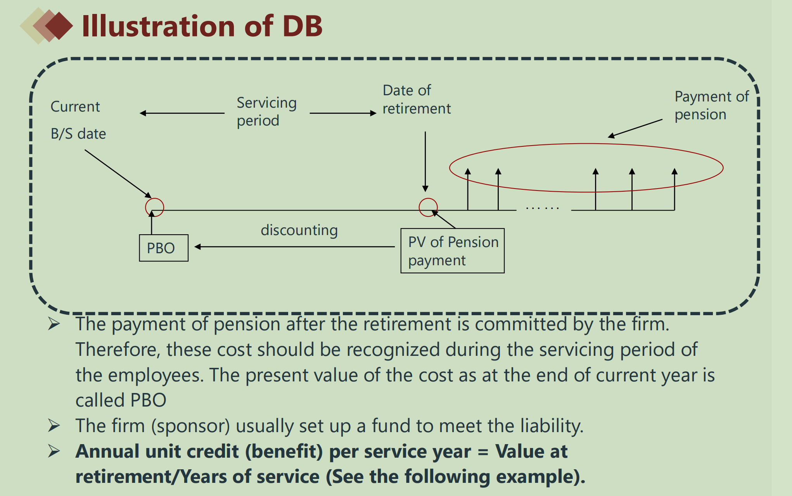
#### 资产负债表上的核算（两个准则完全相同）
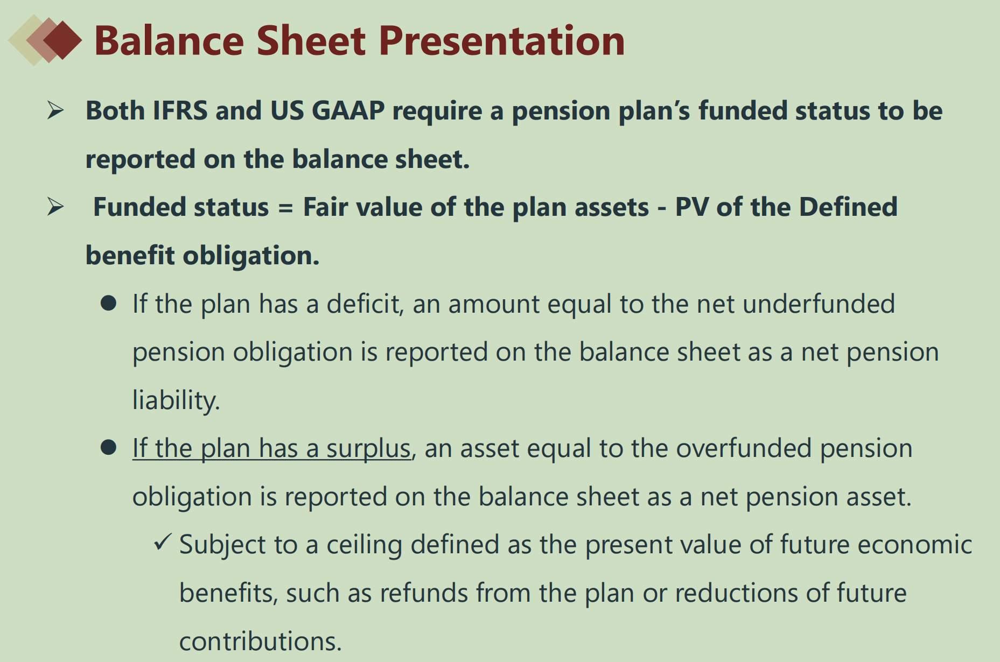
资产负债表上只有这个科目可以以净额来列示
资产端不能超过ceiling：是未来refund和reduction的经济利益现值，考试会给
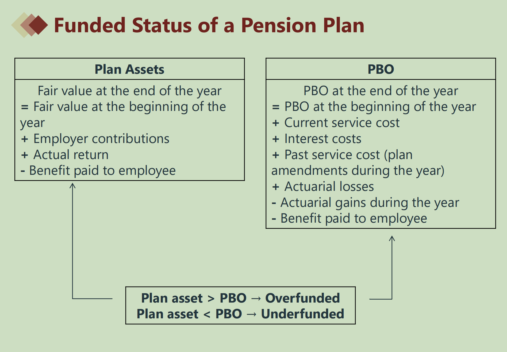
plan asset（资产）=年初数+本期增加数（雇主投入，投资收益）-本期减少数（支付养老金）
PBO（负债）=年初数+本期增加数（因为工作时间增加的养老金的折现现值+养老金的利息成本（PBO乘折现率）+past service cost（由于养老金计划的变化产生的支付成本+精算假设的修正actuarial losses）-本期减少项（actuarial gain-付给员工的部分）
假设条件：
- 折现率：高质量无违约债券（久期一致）
- 退休前工资：可以使用增长率
- Vesting：如果有这个条件，例如不满十年只能拿三分之一，则乘上三分之一。

### 利润表（两个准则下不同）
#### IFRS（四项进利润表，两项进OCI）
1. current service cost（费用列示）
随着时间的增加，要支付的养老金的增加的部分
2. past service cost（费用列示）
养老金计划变化产生的cost
3. 利息费用和收入（年初资产乘**折现率**）（以净额来列示）（列示费用）
（PBO-asset）*市场利率
4. re-measurement
- 因精算假设改变造成的部分**计入OCI**
- 两个收益之间的差额：plan asset当年产生的实际收益-假设收益，**计入OCI**

#### GAAP（有两个项目要先进OCI，再摊销进利润表）
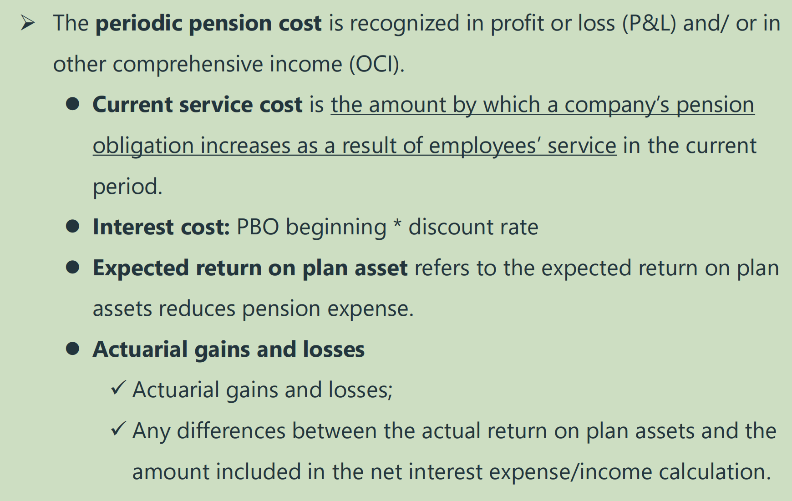
1. （利润表）current service cost（费用列示）
2. （利润表）interest cost：最后出来给员工本金外还要给利息
3. （利润表）xpected return ：年初的养老金资产乘的是预期回报率，（IFRS乘的事折现率）
4. （OCI）past service cost（费用列示）：发生的金额以剩余工作年限来摊销，**摊销完的进利润表，没有摊销完的在OCI**
5. （OCI）acturial gain and loss：
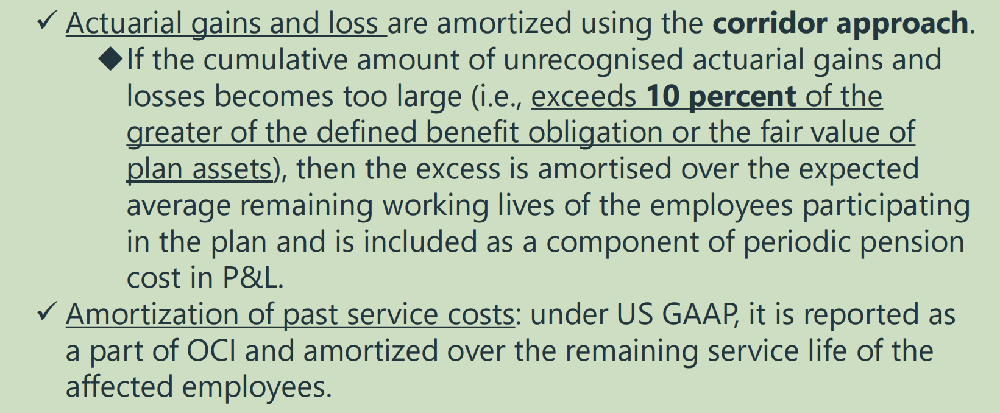
包含1.因精算假设产生的gain或loss，2.养老金资产今年实际获得的回报和之前计入利润表的预期收益之间的difference

### 总结
#### IFRS
1. 资产负债表：BASE法则
plan asset（资产）=年初数+本期增加数（雇主投入，投资收益）-本期减少数（支付养老金）
PBO（负债）=年初数+本期增加数（因为工作时间增加的养老金的折现现值+养老金的利息成本（PBO乘折现率）+past service cost（由于养老金计划的变化产生的支付成本+精算假设的修正actuarial losses）-本期减少项（actuarial gain-付给员工的部分）
2. 利润表
- current service cost（费用列示）
随着时间的增加，要支付的养老金的增加的部分
- past service cost（费用列示）
养老金计划变化产生的cost
- 利息费用和收入（年初资产乘**折现率**）（以净额来列示）（列示费用）
（PBO-asset）*市场利率
- re-measurement
因精算假设改变造成的部分**计入OCI**
 两个收益之间的差额：plan asset当年产生的实际收益-假设收益，**计入OCI**

#### GAAP
1. 资产负债表：BASE法则
plan asset（资产）=年初数+本期增加数（雇主投入，投资收益）-本期减少数（支付养老金）
PBO（负债）=年初数+本期增加数（因为工作时间增加的养老金的折现现值+养老金的利息成本（PBO乘折现率）+past service cost（由于养老金计划的变化产生的支付成本+精算假设的修正actuarial losses）-本期减少项（actuarial gain-付给员工的部分）

2. 利润表
- （利润表）current service cost（费用列示）
- （利润表）interest cost：最后出来给员工本金外还要给利息
- （利润表）expected return ：年初的养老金资产乘的是预期回报率，（IFRS乘的事折现率）
- （OCI）past service cost（费用列示）：发生的金额以剩余工作年限来摊销，摊销完的进利润表，没有摊销完的在OCI
- （OCI）acturial gain and loss：
包含1.因精算假设产生的gain或loss，2.养老金资产今年实际获得的回报和之前计入利润表的预期收益之间的difference

## 其他
### 精算假设条件改变（记住结论）
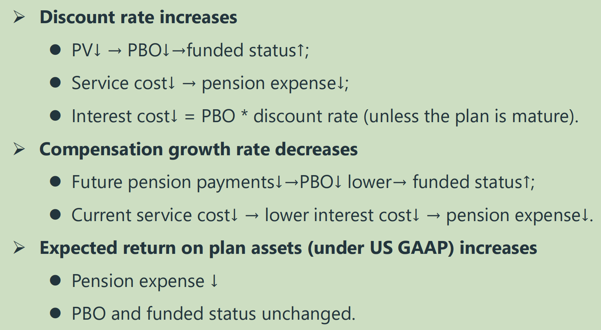
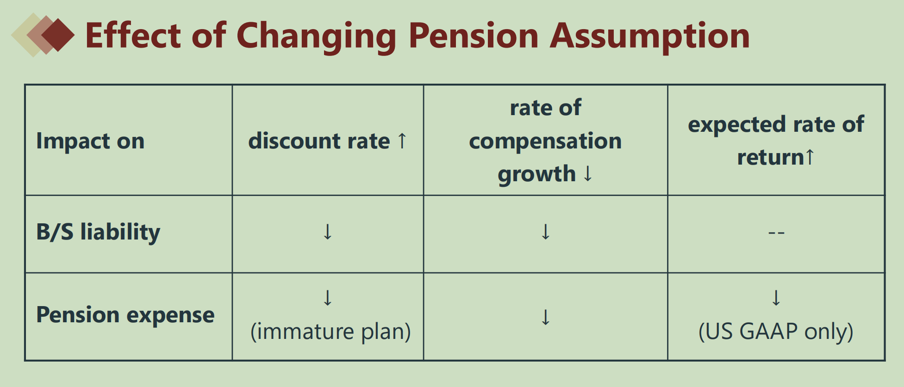
### OPB（哪些因素会导致OPB的上升和下降）
前期高增长，后期缓慢增长，增长率有个突降
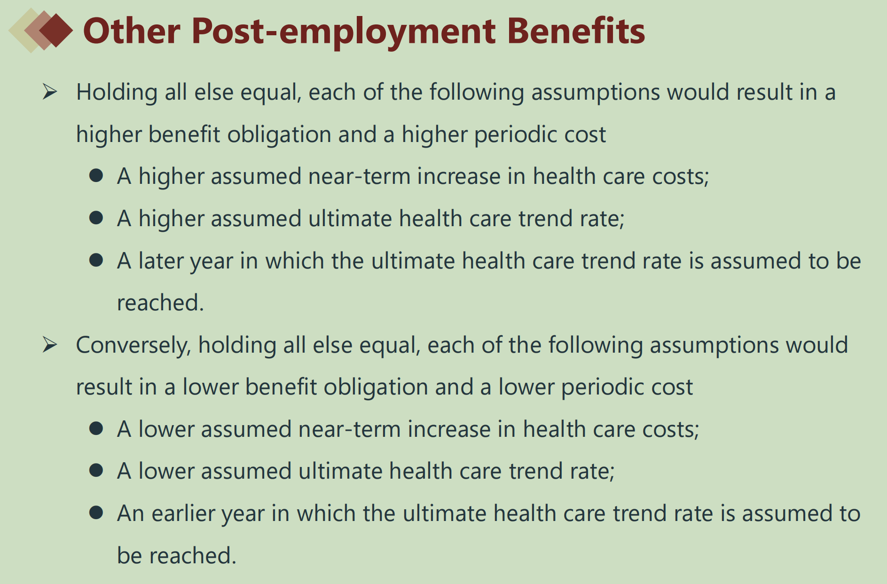

### 注意要点
1. 精算假设是否有区别（用精算假设做调整）
2. 准则不一样，看做整体来进行对比 

# 外币折算（公司在国内，海外子公司外币报表折算）

## 外币交易
海外销售：形成外币计价的应收账款，外币升值确认收益（gain），贬值确认损失（loss）。
海外采购：形成外币计价的应付账款，外币升值确认损失（loss），贬值确认收益（gain）。
外币交易形成的汇率损益需全部计入利润表，与外币报表折算的汇率损益处理方式不同。

## 外币报表的折算
外币报表折算指将海外子公司报表折算为母公司本币后合并的过程（foreign currency translation）。核心步骤包括：
确定折算路径：需明确从子公司当地货币（local currency）到功能性货币（functional currency），再到报告货币（reporting currency）的转换关系
选择折算方法：根据货币关系采用时态法（temporal method）或即时汇率法（current rate method）
### 方法选择
报告货币（reporting currency）：母公司财务报表使用的货币
当地货币（local currency）：子公司注册地法定货币
功能性货币（functional currency）：子公司日常业务活动主要使用的货币
功能性货币的判定标准取决于业务实质，可能与当地货币不同。例如英国注册但主要业务在欧元区的子公司，其功能性货币应为欧元。

local → functional：时态法（temporal）——functional → reporting：即时汇率法（current）

情形1：local=functional时，仅需functional→reporting，采用即时汇率法
情形2：functional=reporting时，仅需local→functional，采用时态法
独立子公司（independent）：业务高度本地化，适用即时汇率法
一体化子公司（integrated）：业务与母公司高度关联，适用时态法

| 折算方法 | 汇兑损益处理方式 | 影响报表 |
|---|---|---|
| current rate法 | 计入其他综合收益（OCI） | 资产负债表 |
| temporal法 | 计入当期利润表 | 利润表 |

### 即时汇率法（current rate method）（汇兑损益记在OCI，后算）
第一步：利润表折算：
所有科目采用年度average rate
第二步：资产负债表折算
- 资产：current rate
- 负债：current rate
- equity：
实收资本（历史汇率）
留存收益（BASE）：通过基期数+折算后净利润（之前算了）-折算后股利推算（股利采用宣告日汇率）
OCI（有时候会写CTA）：equity-折算后的实收资本-折算后的留存收益

### 时态法（temporal method）（汇兑损益进利润表，后算）
第一步：资产负债表
- 资产：
货币性资产（现金，应收账款等）：current rate
非货币性资产（随市场变化的：存货，固定资产，无形资产）：historical rate
- 负债：
货币性负债（几乎都是）：current rate
非货币性负债（唯一是预收账款（unearned revenue）：historical rate
- equity：
实收资本（历史汇率）
留存收益（BASE）：equity-折算后的实收资本

第二步：利润表
大多数都用average rate，**COGS/折旧摊销用historical rate**，计算出来的是没有考虑汇兑损益之前的NI
**真正的净利润计算（BASE）**
通过期初留存收益（上年折算数据）
**加当期净利润（需调整汇兑损益）**
减股利支付（按宣告日汇率折算）
等于期末留存收益（由资产负债表权益差额倒推）

真正的净利润和没有考虑汇兑损益之前的NI相减就是汇兑损益

>存货在temporal method下属于非货币性资产，需用历史汇率折算。
>存货计价方法影响折算金额：先进先出法（FIFO）下，老存货先售出计入COGS（用较老汇率折算），新存货留存账面（用较新汇率折算）；后进先出法（LIFO）下则相反。
>current rate method下留存盈利计算：采用贝斯法则，年初留存盈利+折算后净利润-股利=年末留存盈利。
>temporal method下留存盈利计算：无需贝斯法则，直接通过权益总额-实收资本得出，因汇兑损益计入利润表而非OCI。

### 考试考法
#### 针对单独的科目来折算

#### 这家公司当年的汇兑损益是gain还是loss
- temporal method下，风险敞口计算公式为：
货币性资产 - 货币性负债
结果>0：风险敞口在资产端，外币升值产生收益（gain），贬值产生损失（loss）。
结果<0：风险敞口在负债端，外币升值产生损失（loss），贬值产生收益（gain）。
- Current Rate Method下的风险敞口   
在current rate method下，所有资产与负债均受汇率波动影响，风险敞口计算公式为：
总资产 - 总负债 = 股东权益
正常公司风险敞口恒为资产端（总资产>总负债），外币升值产生收益（gain），贬值产生损失（loss）。

#### 针对于不同的财务指标
1. 如果用curret rate来折算
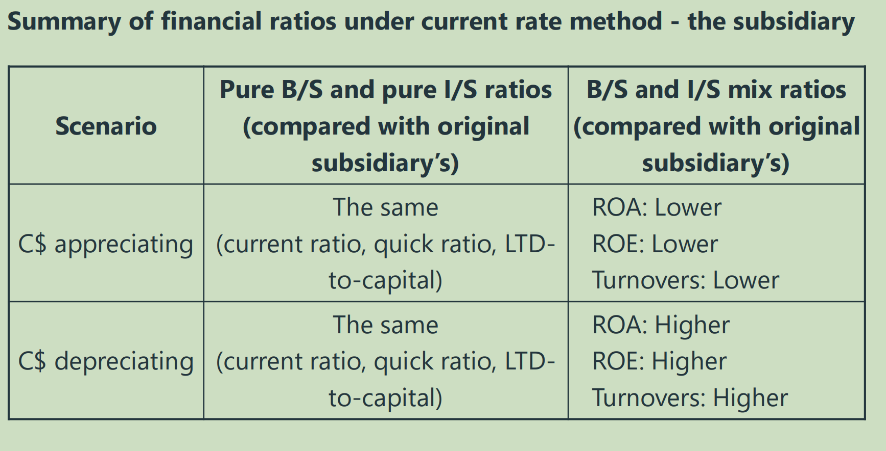

2. 随着折算方法变化的变动
重点对比两种方法对财务比率的影响，**需先明确外币升值或贬值环境下的汇率大小关系（贬值：historical > average > current）**。
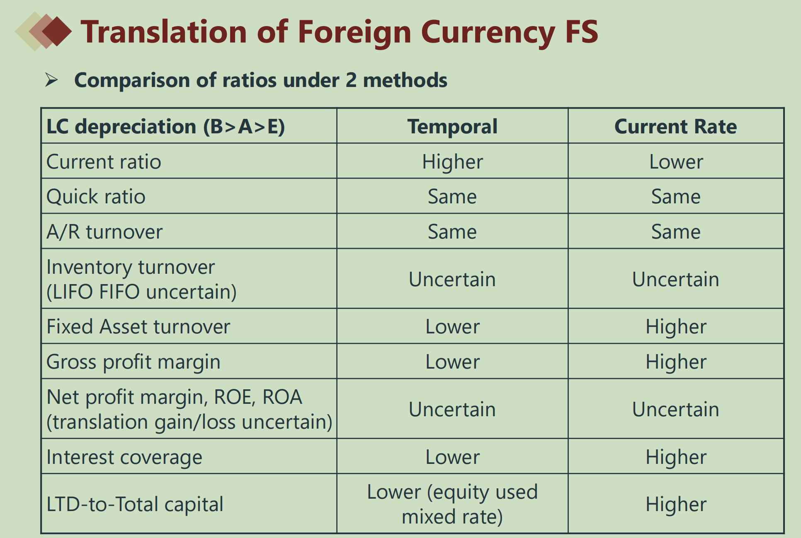
- 流动比率（流动资产/流动负债）：

## 恶性通货膨胀
### 定义
连续三年累计物价涨幅超过100%，且需按复利计算，即（年均约26%涨幅）
核心特征：本币大幅贬值，货币购买力急剧下降
### 国际准则下恶性通胀的处理 
#### 资产负债表
货币性项目：现金、应收账款等金额固定的项目不调整，直接按当前汇率折算
非货币性项目：固定资产、存货等需先按物价指数重述（如物价涨50%则账面价值调高50%），再用汇率折算
股东权益：所有权益项目需从期初开始按一般物价水平变化重述
#### 利润表
重述原则：所有项目需按物价指数从记录日到资产负债表日的变化进行重述
折算汇率：重述后使用当年平均汇率折算
特殊处理：持有货币性资产/负债产生的购买力净损益计入净利润
> 恶性通胀下的汇兑损益全部计入到利润表

### 抗恶心通货膨胀
负债端策略：增加本币负债（贬值后实际债务减少）
资产端策略：
购买非货币性资产（大宗商品、房地产等实物资产）
配置外币资产（对冲本币贬值风险）
操作逻辑：通过"借贬值货币→买增值资产"实现套期保值

## 国际业务的税务影响
### 差异
1. 不可抵扣费用
核心机制: 费用发生但税法不允许税前扣除→利润虚增→税负增加
典型案例:
罚款/滞纳金（如环保处罚100万需纳税调增）
数据对比：A公司+3.5%，B公司+2.0%
记忆口诀: "违法支出不能抵，税负必然往上提"
2. 免税收入 
国债利息收入
环保/新能源业务收入（政策鼓励）

3. 海外子公司影响
作用原理:
海外税率>本国→拉高有效税率（如A公司+3.0%）
海外税率<本国→拉低有效税率（如B公司-1.5%）
战略应用:
在低税率国家设子公司可降低整体税负
4. 亏损递延
抵税规则:
当年利润可抵减前5年亏损
抵减顺序：先到期亏损先抵减
计算案例:
第1年亏100万，第3年赚100万→第3年免税
第2年亏50万，第4年赚200万→第4年应税150万

# 金融机构报表（商业银行，保险公司）
## 基础
### 巴塞尔协议
- 三大目标为：1.提升抗⻛险能⼒，2。优化⻛险管理与公司治理，3.增强透明度与信息披露

- 三个重要点：1.资本充⾜率（Minimum Capital）：确保资本⾦覆盖⻛险，2.短期流动性（Liquidity）：评估30天内现⾦偿付能⼒（传统⾏业以1年为界），3.稳定资⾦（Stable Funding）：保障1年内资⾦需求

## 银行（CAMEL）
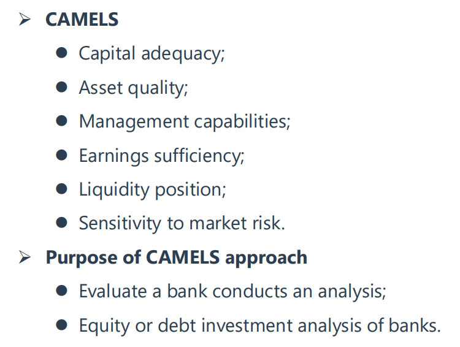

### Capital adequacy（计算，资本金分类，巴塞尔协议最低要求
1. 计算公式：
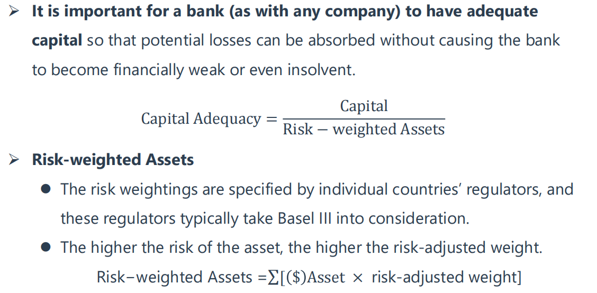
2. 资本金分类（Basel III）
- **核心一级资本（CET1）**
  - 普通股（实收资本）+ 留存收益 + 其他综合收益（OCI）
  - 扣除项：商誉、无形资产、递延所得税资产（DTA）、递延薪酬资产、对自身股票的持仓等
  - 最低要求：≥ 4.5% RWA
- **其他一级资本（AT1）**
  - 非累积优先股、或有可转债（CoCos）
  - 条件：无到期日（永续）、无累计派息义务、发行5年后方可赎回（需监管批准）
  - 触发机制：当CET1 < 5.125%时，AT1工具自动转股或减记（write-down）
  - **CET1 + AT1 ≥ 6.0% RWA**
- **二级资本（Tier 2）**
  - 次级债务（原始期限≥5年）、超额贷款损失准备（上限为信用RWA的1.25%）
  - 最后5年按直线法逐年摊销（剩余期限<5年时逐步剔除）
  - **CET1 + AT1 + T2 ≥ 8.0% RWA**
- **资本缓冲（均为CET1）**
  - 资本留存缓冲（CCB）：2.5%
  - 逆周期缓冲（CCyB）：0~2.5%
  - 系统重要性银行附加（G-SIB/D-SIB）：1%~3.5%
  - → 实际总CET1要求可达 7%~9.5%
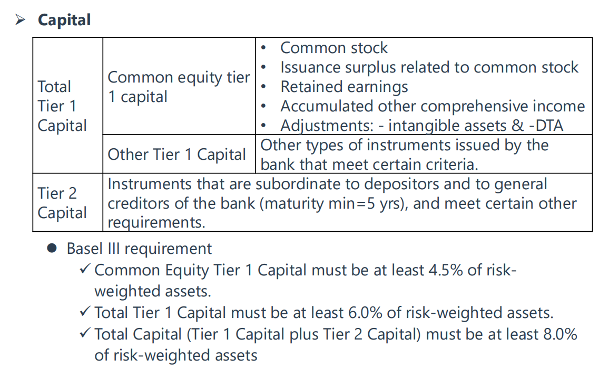

3. 巴塞尔协定规定
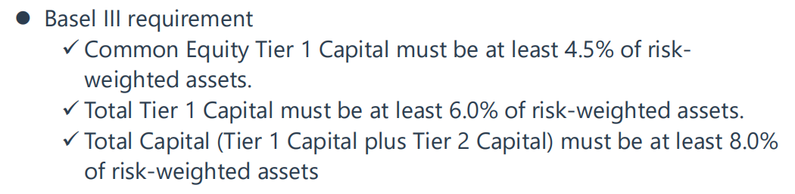

### Asset Quality（信用质量和预期损失）
#### 信用质量
- 五级分类：正常、关注、次级、可疑和损失五级，重点关注迁徙率，即
贷款评级下降的⽐例。迁徙率上升表明资产质量恶化。
- 三阶段预期损失
第⼀阶段：⻛险未显著变化，计算⼀年内预期损失。
第⼆阶段：⻛险显著上升，计算贷款存续期内预期损失。
第三阶段：贷款已发⽣损失，直接计提减值拨备。

### Management Capabilities
主要涉及盈利能力和风险管理能力，但是更加侧重风险管理能力
主要分类：
信⽤⻛险（贷款违约）
市场⻛险（利率/汇率变动导致的资产价值波动）
操作⻛险（⽇常经营中产⽣的⻛险）
法律⻛险（违规操作引发的⻛险）

### Earnings Sufficiency
⾼质量盈利的三⼤标准：
- 真实性：利润数据需经审计验证
- 可持续性：避免依赖⾮经常性收益（如投资收益占⽐过⾼）
- 充⾜性：投资回报率必须⾼于股东机会成本，例如股东投⼊100万资⾦成本时，净利
润需超过100万才实现真正盈利

⾦融资产公允价值计量优先级：
- 活跃市场报价（如上市公司股票）
- 类似资产报价（⽆直接报价时参照可⽐资产）
- 估值模型（缺乏市场数据时采⽤）

### Liquidity Position
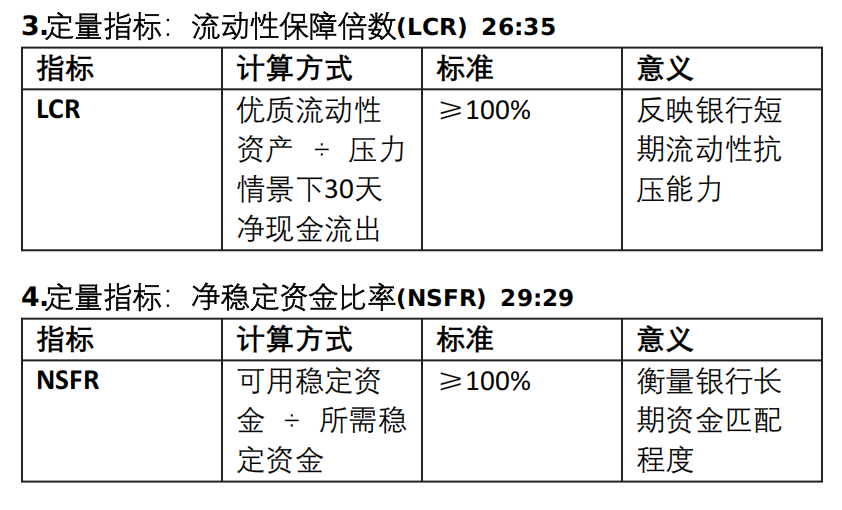
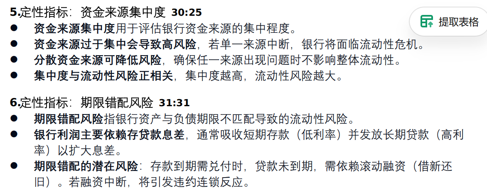

### 其他风险
#### 市场风险
主要包括：利率风险，汇率风险，价格风险
理论情况：利润来源于资产规模大于负债产生的规模收益
现实情况:一部分是鼓膜收益，还有一部分是期限错配收益

### 其他非核心指标因素

## 保险
### 基础
1. 收入来源：保费收入，投资收益
2. 成本：理赔指出
3. 关键概念：
- 保费分摊机制：保单存续期内，实际⻛险与保费不匹配时，保险公司采⽤平均分
摊法平衡客户现⾦流压⼒，导致前期保费收⼊确认低于实际收款，差额计⼊预收
账款（现⾦价值）。
- 分红险原理：预收账款部分投资产⽣的收益以分红形式返还投保⼈，保险公司仅
将⾃有资⾦投资收益计⼊利润表

4. 主要分类：财产保险和人寿保险

5. 对比

| 分析维度       | 财险特点                                                                 | 寿险特点                                         |
|----------------|--------------------------------------------------------------------------|--------------------------------------------------|
| 商业模式       | 直销（固定成本高）或代销（无固定成本），**代销更利于控制财务风险**。     | 同左，但寿险产品复杂度更高。                     |
| 盈利能力       | 依赖保费与理赔差额，**需关注理赔率估算准确性**。                         | 同左，但寿险理赔更可预测。                       |
| 投资收益       | 次要收入来源，需匹配流动性需求。                                         | 主要收入来源，可配置长期高风险资产。             |
| 流动性         | **流动性风险高**（理赔时间与金额不可预测），需保持充足现金储备。         | 流动性风险低，资金可长期规划。                   |
| 资本充足率     | 重要性低于银行，但仍需满足监管要求。                                     | 同左，但资本压力相对较小。                       |

### 财产险

| 指标名称       | 英文全称                               | 定义                                                                 | 含义与关键特征                                                     |
|----------------|----------------------------------------|----------------------------------------------------------------------|--------------------------------------------------------------------|
| 理赔费用率     | Loss and Loss Adjustment Expense Ratio | 理赔支出（含调查等环节相关费用）占净保费收入的百分比                 | 指标越低，盈利能力越强；理论上限不得超过100%                       |
| 承保费用率     | Underwriting Expense Ratio             | 承保环节（如风险评估、体检等）成本占净保费收入的百分比               | 与理赔费用率共同构成保险公司的主要成本                             |
| 综合费用率     | Combined Ratio                         | 理赔费用率与承保费用率之和                                           | 反映保险公司总成本占比；需低于100%，否则承保业务本身处于亏损状态 |

### 人寿险
1. 商业模式：只要是to C都是代销
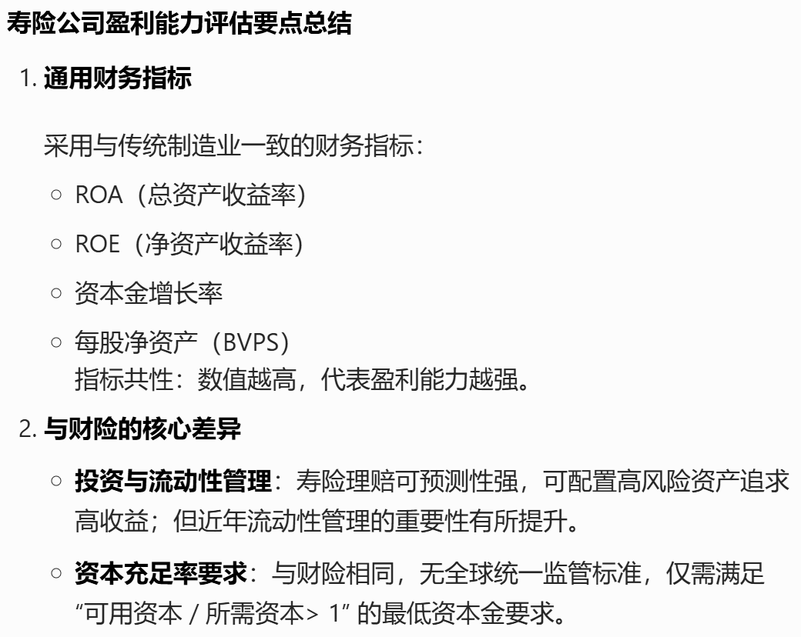

# 评估报表质量（三张表单独分析，强调可持续（质量））（定性和定量）
二级处理真实性还需要看盈利质量。
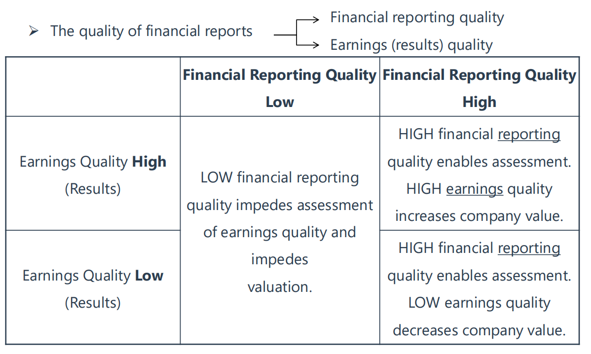
### 质量光谱
符合准则，信息对投资决策有帮助，可持续的盈利（不仅要保证准确性，还要保证盈利可持续），看是否操纵报表，能覆盖股东资金成本。
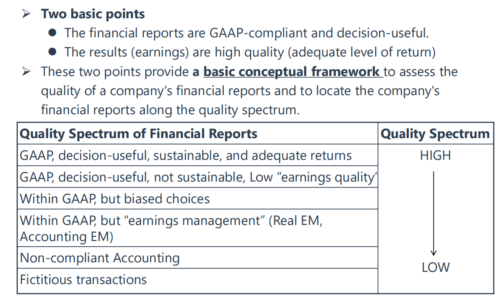
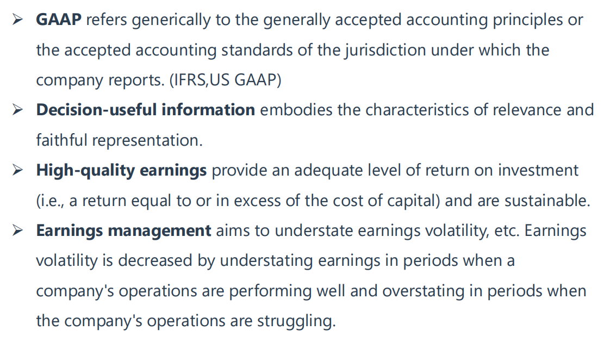
## 整体质量（重点）
### 定性分析
报表数据是否出现偏差（aggressive或者consevative（少交税/哭穷）
#### aggressive
做高收入：提前确认收入，硬编
做低费用：
做高金融资产：使用估算的方法，自由度高
低估负债：低估或有负债，低估金融负债
现金流：加速收款，减速付款，另外可以调分类
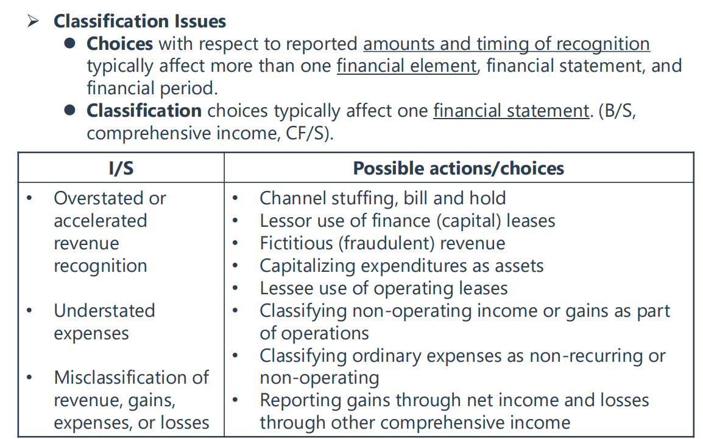
- 出租方融资租赁，当年可多确认一笔收入。承租方倾向于经营租赁，可以进行表外融资。
- 虚构交易
- 费用化项目资本化：当年不用计费用
- 将营业外收入记为经营费用，经营费用记为营业外费用
- 计入OCI
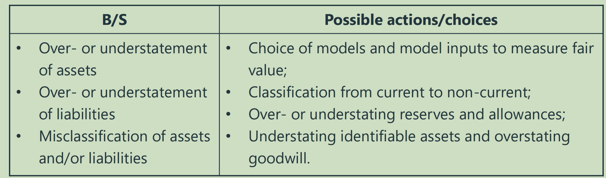
- 做高资产、做低负债：通过非公允定价的金融资产，通过流动资产和非流动资产的分类（流动资产要变现产生gain和loss，不希望产生可以分为非流动资产），对减值类项目要注意（藏利润可以用减值，之后再转回），商誉不摊销。
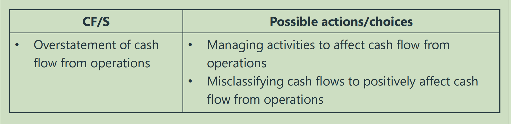
调节现金流的时间，换科目来记
#### 并购
自己现金流不行，通过收购别的公司来补cashflow，用股份收购还不用花现金。并购就是一个一次性现象。
收购方和被收购方为了让自己有利会调整自己的报表。调低可辨认净资产，调高商誉，但是商誉每年要做减值测试

#### 不是刻意调整的项目（分析师需要自己评估）
1. normalizing：把一次性项目剔除
2. 对会计假设的变化
3. 大幅计提损失，之后转回

### 定量分析
基于财务数据，但是和公司真实经营情况可能有差别。模型会被反向利用，尽可能网好的方向调整。
#### Beneish Model（M-score）（越低越好）
系数为正说明是证明造假的指标，系数为负说明是好的指标
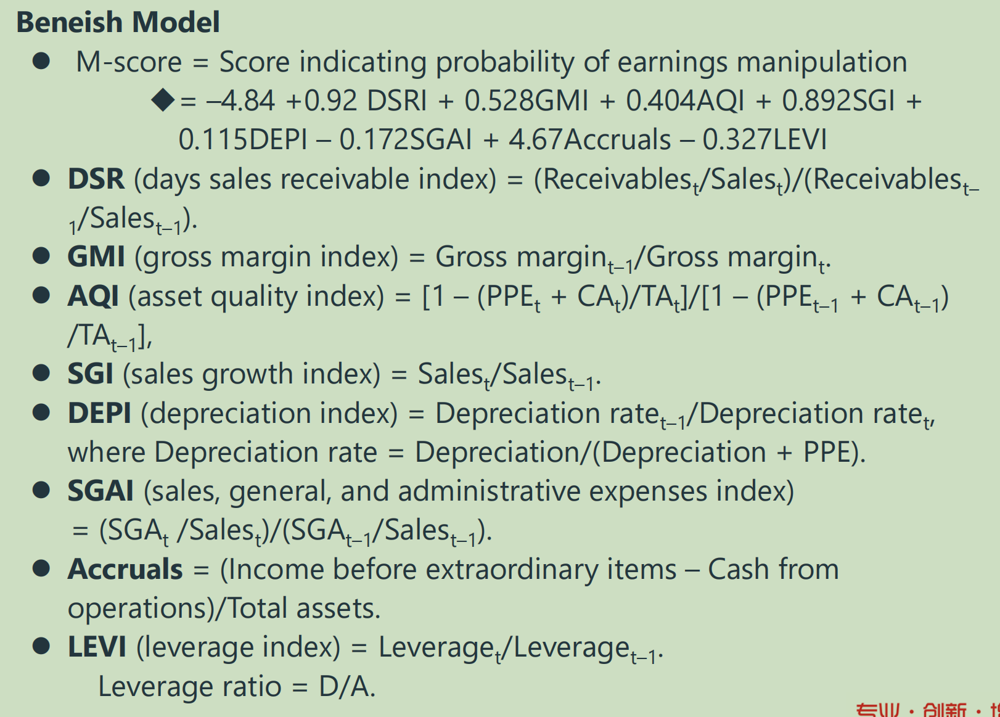
DSR：应收款项的收入占比的增长
GMI：去年毛利比上今年毛利
AQI：无形资产占总资产的比重，今年比去年
SGI：销售比，今年比去年
DEPI：去年折旧率/几年折旧率
SGAI：今年费用率/去年费用率
accruals：确认了收入但是没收到现金/总的资产
LEVI：今年杠杆率/去年杠杆率
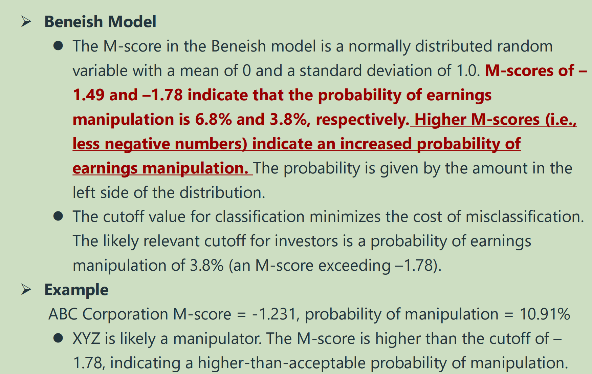
分界值：-1.78

#### Z-score（越高越好）
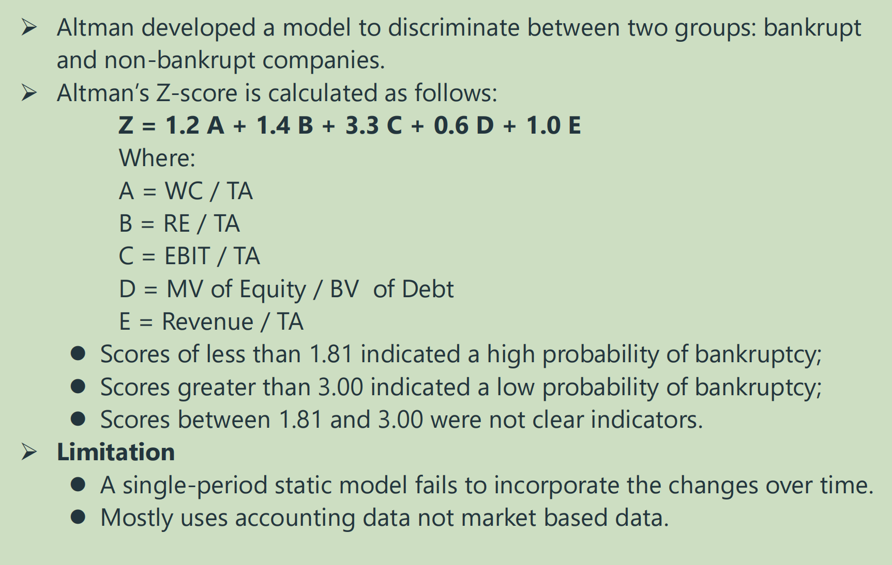
A:营运资本/总资产
B:留存收益/总资产
C:EBIT/总资产
D:equit/debt
E:收入/总资产

## 利润表（盈利质量是重点）
1. 无偏（数据要真实，不能造假）
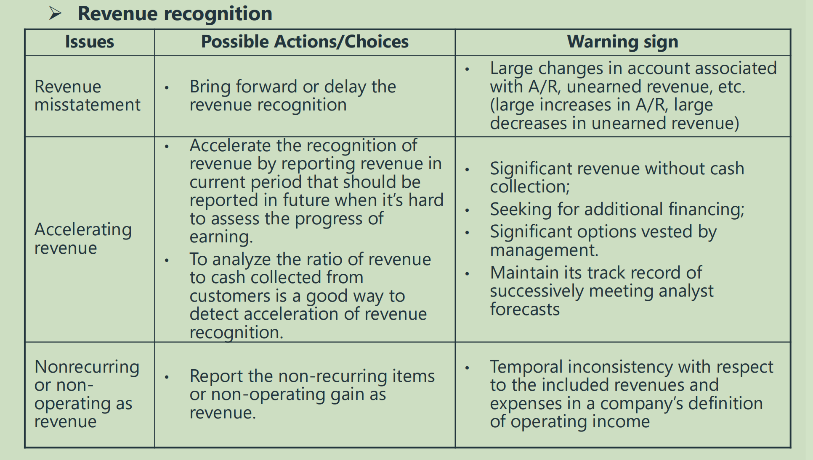
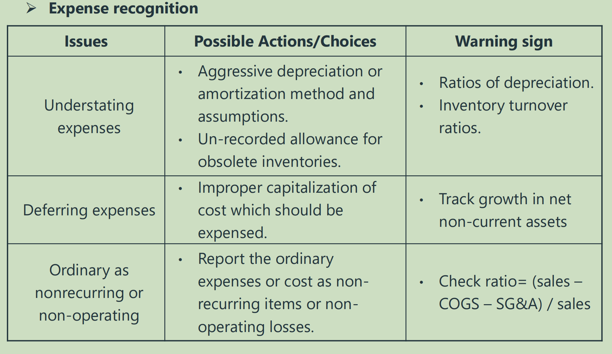
2. sustainable（重要）（可持续盈利）
3. 要能覆盖资金成本
### 如何判断可持续性
#### 线性回归
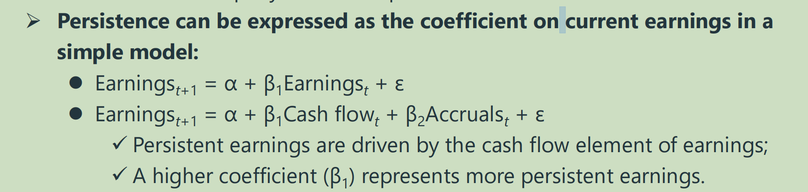
每一年利润额和上一年利润做回归，β越大说明持续性越好
多元回归：回归现金流（这是好的）和accruals（没有收到现金的）
#### 均值回归
时间够长会均值回归，如果离历史剧至太原，则不可持续

## 资产负债表
1.完整性：不能有太多表外项目。2.真实性，3. 清晰
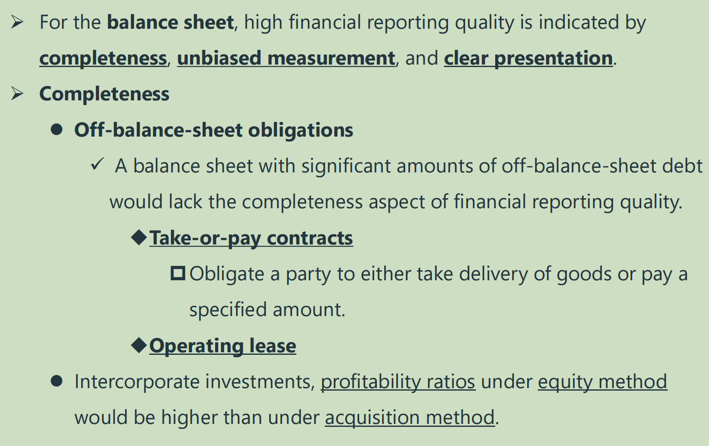
采购合同：要么买要么付违约金
经营租赁：只确定当年的租金，剩下的租金无形当中放到了表外

## 现金流量表
1. 正数
2. 可持续
3. 获得的现金流能够cover开支
4. 稳定
### 操纵现金流
1. 改变现金流时间
2. 调整现金流分类
如果收入和利润上升但是现金流下降，很可能是虚增

# 现实应用
## 步骤
1. 分析目的和背景：不同的人的角度不一样
2. 搜集数据
3. 处理数据
4. 分析
5. 提供建议
6. 定期更新和跟踪
## 股权投资
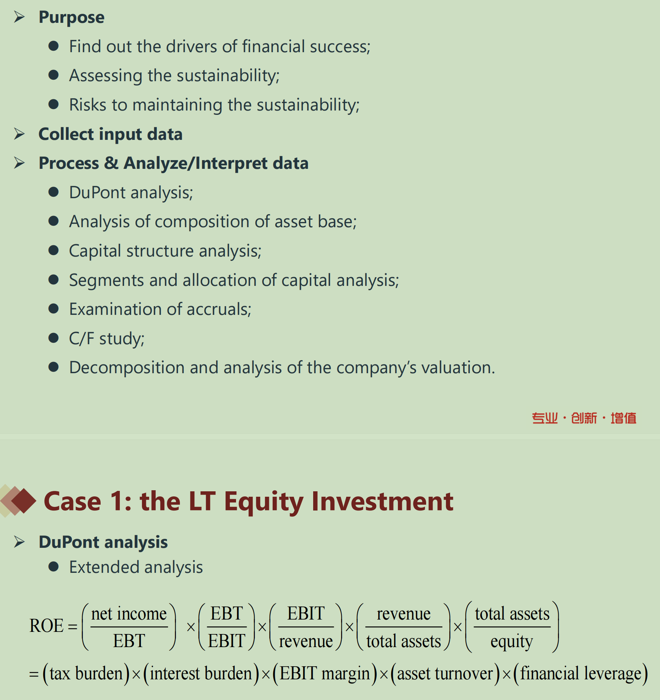
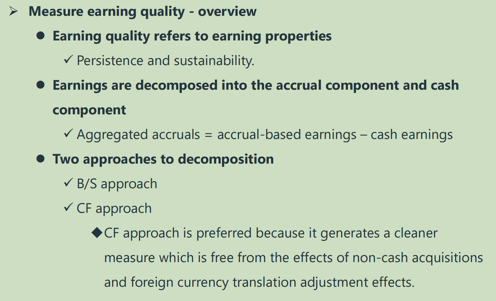
## 计算accruals
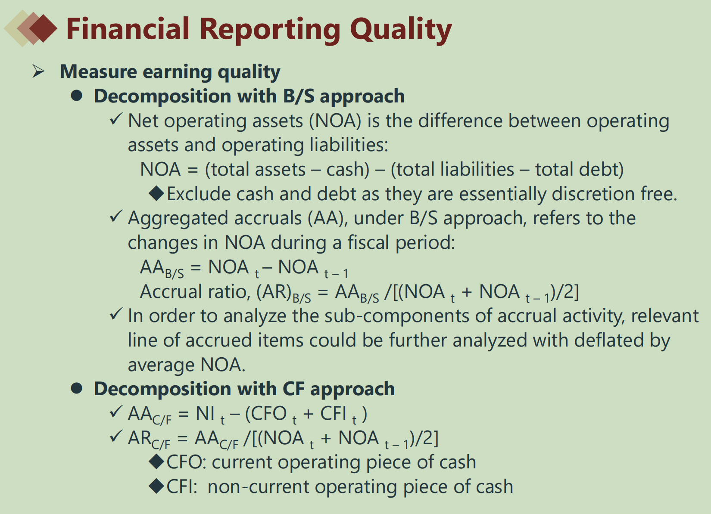

# 报表建模

